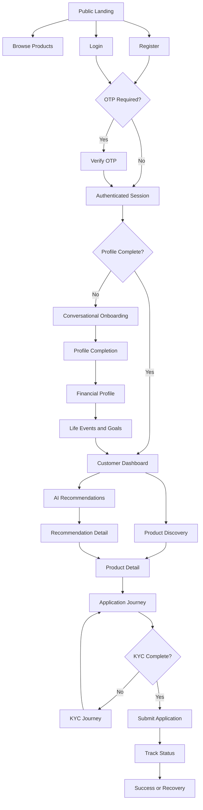
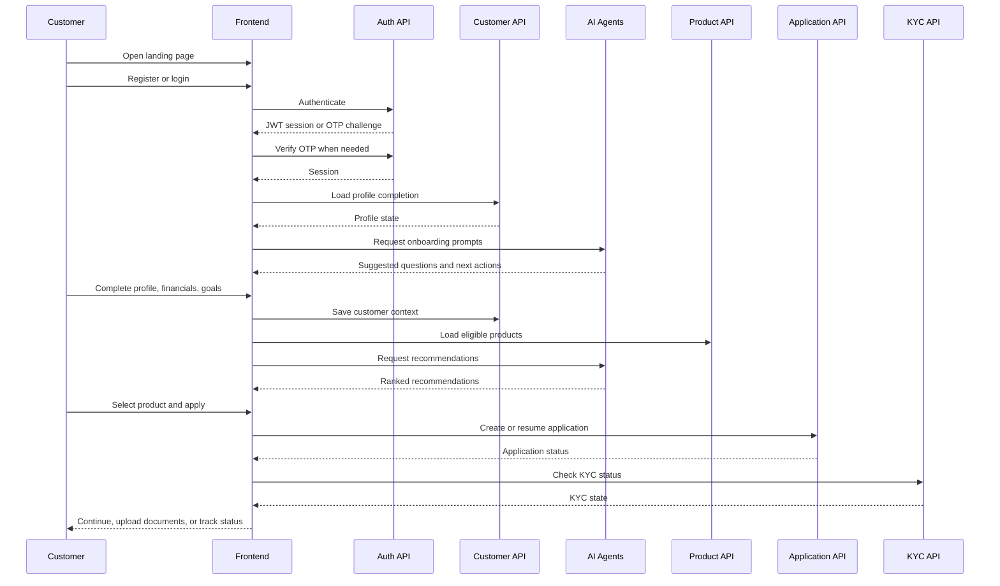

# Section 5: Customer Journey Experience

## Section Metadata

Section: 5 - Customer Journey Experience  
Version: 1.0.0  
Status: Documentation only  
Dependencies: Sections 1-4  
Extends: Existing BankMate AI frontend, routing, layout, auth, backend APIs, AI agents  
Modifications: None to backend, APIs, database, Redis, Kafka, AI agents, or business logic

## Compliance Declaration

- Backend architecture: unchanged
- Database schema: unchanged
- API endpoints: unchanged
- Authentication and session management: unchanged from Section 4
- Routing and guards: unchanged from Section 2
- Layout architecture: unchanged from Section 3
- Documentation only: confirmed
- React/TypeScript/CSS implementation: not modified by this section

## 5.1 Customer Journey Overview

Section 5 defines the complete customer-facing journey from public discovery to authenticated onboarding, profile completion, product discovery, recommendations, applications, KYC, success, recovery, empty states, loading states, accessibility, and responsive behavior.

Primary journey stages:

1. Public landing and product discovery
2. Registration or sign-in
3. AI conversational onboarding
4. Customer profile completion
5. Financial profile collection
6. Life event and goal discovery
7. Product discovery and recommendation review
8. Product details and comparison
9. Application journey handoff
10. KYC journey handoff
11. Success, recovery, and re-engagement

## 5.2 Landing Page Experience

Entry routes:

- `/`
- `/products`
- `/products/:productId`
- `/about`
- `/contact`
- `/help`

Purpose:

- Explain BankMate AI value clearly.
- Drive users to register, sign in, browse products, or ask for help.
- Preserve public access without requiring authentication.

Expected landing behavior:

- Primary CTA routes to `/auth/register`.
- Secondary CTA routes to `/auth/login`.
- Product cards route to public product details.
- Authenticated users are redirected by existing guards to role-appropriate dashboards.

## 5.3 AI Conversational Onboarding

Conversational onboarding is a guided layer that helps customers complete profile data with less form friction.

Owned by existing AI/backend architecture:

- ConversationalAgent
- NextBestActionAgent
- RecommendationAgent

Frontend journey contract:

- The customer can answer onboarding prompts conversationally.
- Captured answers map to existing customer profile fields.
- The user must always be able to review and edit structured fields before submission.
- AI suggestions are assistive, not authoritative.

## 5.4 Registration Journey

Entry routes:

- `/auth/register`
- Public CTA from landing/product/help routes

Flow:

1. Customer enters account details.
2. Frontend validates required fields.
3. Registration request maps to existing customer registration API.
4. If OTP is required, route to `/auth/otp-verify`.
5. On success, set auth session through Section 4 session store.
6. Redirect to `/customer/onboarding` when profile is incomplete.

Recovery:

- Duplicate email/mobile: show field-level message.
- Network failure: show retry alert.
- OTP expired: allow resend or restart registration.

## 5.5 Customer Profile Completion

Routes:

- `/customer/onboarding`
- `/customer/onboarding/:step`
- `/customer/profile`
- `/customer/profile/edit`

Required profile areas:

- Personal details
- Contact details
- Employment/customer type
- Communication preferences
- Consent and data usage acknowledgement

Completion rule:

- Profile completion percentage controls guard behavior through the existing auth/profile store.
- Incomplete customers are guided to onboarding before full dashboard usage.

## 5.6 Financial Profile Collection

Route:

- `/customer/profile/financial`

Captured data categories:

- Monthly income
- Employment or business type
- Existing liabilities
- Credit score or credit band when available
- Existing banking relationship
- Preferred product categories

Usage:

- Affordability checks
- Product eligibility
- Recommendation scoring
- Application prefill

No business logic changes are introduced here; frontend only collects and displays data from existing APIs.

## 5.7 Life Event Collection

Routes:

- `/customer/life-events`
- `/customer/life-events/:eventId`

Life event examples:

- Marriage
- Home purchase
- Child education
- New job
- Business expansion
- Retirement planning
- Travel or relocation

Journey behavior:

- Customer can add, review, confirm, dismiss, or update life events.
- AI-detected life events must show explainability and confirmation controls.
- Confirmed events influence dashboard priority and recommendation context.

## 5.8 Goal Discovery

Routes:

- `/customer/goals`
- `/customer/goals/new`
- `/customer/goals/:goalId`
- `/customer/goals/:goalId/edit`

Goal categories:

- Savings
- Home ownership
- Education
- Debt reduction
- Retirement
- Emergency fund
- Business growth

Expected UX:

- Guided goal creation.
- Target amount and target date.
- Monthly contribution estimate.
- Related products or recommendations shown contextually.

## 5.9 Product Discovery Journey

Routes:

- `/customer/products`
- `/customer/products/:productId`
- `/customer/products/compare`
- `/products`
- `/products/:productId`

Discovery behavior:

- Public product browsing is informational.
- Authenticated browsing can personalize eligibility, match score, and affordability.
- Filters should preserve URL state when possible.
- Product comparison should not require re-entering prior filter selections.

Product categories:

- Loans
- Credit cards
- Savings accounts
- Fixed deposits
- Insurance
- Investments

## 5.10 AI Recommendation Journey

Routes:

- `/customer/recommendations`
- `/customer/recommendations/:recId`
- `/customer/recommendations/compare`

Recommendation contract:

- Every recommendation must show why it was recommended.
- Match score must be visible and explainable.
- Eligibility and affordability signals must be clearly separated.
- Every recommendation card has one primary CTA.

CTA mapping:

- Apply now: `/customer/products/:productId/apply`
- View details: `/customer/products/:productId`
- Compare: `/customer/recommendations/compare`
- Ask AI: `/chat`

## 5.11 Product Details Journey

Routes:

- `/customer/products/:productId`
- `/customer/products/:productId/calculate`
- `/customer/products/:productId/apply`

Required detail areas:

- Product summary
- Benefits
- Fees and charges
- Eligibility
- Required documents
- Rate or pricing details
- Calculator entry point where relevant
- Apply CTA

Behavior:

- Authenticated customers get personalized eligibility and prefill context.
- Public users are prompted to sign in or register before applying.

## 5.12 Application Journey

Routes:

- `/customer/applications`
- `/customer/applications/new`
- `/customer/applications/:appId`
- `/customer/applications/:appId/status`
- `/customer/applications/:appId/accept`

Journey contract:

- Product apply routes hand off to application creation.
- Existing application state must be resumable.
- Application status must be visible after submission.
- Offer acceptance is handled only through approved backend state transitions.

Section 5 documents the entry and handoff. Detailed application UX is owned by later application journey specifications.

## 5.13 KYC Journey

Routes:

- `/customer/kyc`
- `/customer/kyc/upload`
- `/customer/kyc/status`

KYC states:

- Not started
- Pending
- Approved
- Rejected

Journey behavior:

- Show current KYC status.
- Explain missing requirements.
- Allow document upload through existing KYC endpoints.
- Rejected KYC must show correction guidance.
- Approved KYC unlocks KYC-gated journeys through existing guards.

## 5.14 Success Journey

Success moments:

- Account created
- OTP verified
- Profile completed
- Goal created
- Life event confirmed
- Recommendation accepted
- Application submitted
- KYC approved
- Offer accepted

UX rule:

- Success states must include the next useful action.
- Avoid dead ends.
- Use toast for lightweight success and full success pages for major milestones.

## 5.15 Error and Recovery Journey

Error categories:

- Validation error
- Authentication error
- Session expired
- Network error
- Permission denied
- Not found
- Server unavailable
- KYC rejection
- Application rejection

Recovery behavior:

- Preserve entered form data when safe.
- Show retry controls for transient failures.
- Use field-level messages for validation.
- Redirect to login for expired sessions.
- Route forbidden access to `/403`.
- Route unknown pages to `/404`.

## 5.16 Empty States

Empty state rules:

- Explain what is missing.
- Show the next action.
- Avoid blame language.
- Prefer action-oriented CTAs.

Examples:

- No recommendations: complete profile or add goals.
- No applications: browse products.
- No life events: add a life event.
- No transactions: connect or refresh account data.
- No notifications: reassure the customer.

## 5.17 Loading States

Loading state rules:

- Initial app bootstrap uses global loading screen.
- Page data loading uses local skeletons or spinners.
- Buttons show inline loading on submit.
- Long-running operations show progress or reassuring copy.
- Background refresh should not block the page unless stale data is unsafe.

## 5.18 Accessibility

Accessibility requirements:

- All form fields must have labels.
- Errors must be associated with fields and announced.
- Keyboard navigation must cover all interactive controls.
- Focus must move to the first invalid field on submit failure.
- Modals must trap focus and restore focus on close.
- Color cannot be the only indicator of status.
- Loading and error states must be screen-reader friendly.
- Touch targets should be at least 44px where feasible.

## 5.19 Responsive Behaviour

Breakpoints follow the established layout system from Section 3.

Mobile:

- Bottom navigation is primary.
- Forms are single column.
- Product/recommendation cards stack vertically.
- Large comparison tables convert to scrollable or card-based layouts.

Tablet:

- Two-column content may be used where scanability improves.
- Sidebars may collapse based on available width.

Desktop:

- Sidebar navigation is available for authenticated roles.
- Dashboard and journey pages can use multi-column widget grids.
- Comparison and detail pages should use denser layouts.

## 5.20 Mermaid User Journey Diagram

## 5.21 Sequence Diagram

## 5.22 Future Scalability

Future additions must preserve current contracts:

- Add new journey steps as route-level extensions, not route rewrites.
- Add new customer data fields through existing profile APIs.
- Add new life event types through configuration where available.
- Add new product categories without changing recommendation card contracts.
- Add new AI agents as assistive surfaces only.
- Keep backend, API, database, Redis, Kafka, and business rules unchanged unless a later approved backend section explicitly changes them.

## Section 5 Completion Checklist

- 5.1 Customer Journey Overview: complete
- 5.2 Landing Page Experience: complete
- 5.3 AI Conversational Onboarding: complete
- 5.4 Registration Journey: complete
- 5.5 Customer Profile Completion: complete
- 5.6 Financial Profile Collection: complete
- 5.7 Life Event Collection: complete
- 5.8 Goal Discovery: complete
- 5.9 Product Discovery Journey: complete
- 5.10 AI Recommendation Journey: complete
- 5.11 Product Details Journey: complete
- 5.12 Application Journey: complete
- 5.13 KYC Journey: complete
- 5.14 Success Journey: complete
- 5.15 Error and Recovery Journey: complete
- 5.16 Empty States: complete
- 5.17 Loading States: complete
- 5.18 Accessibility: complete
- 5.19 Responsive Behaviour: complete
- 5.20 Mermaid User Journey Diagram: complete
- 5.21 Sequence Diagram: complete
- 5.22 Future Scalability: complete
