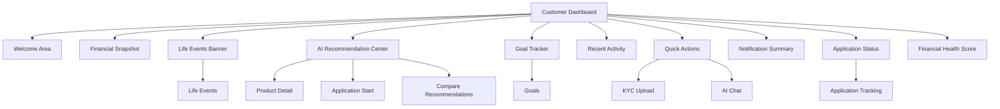
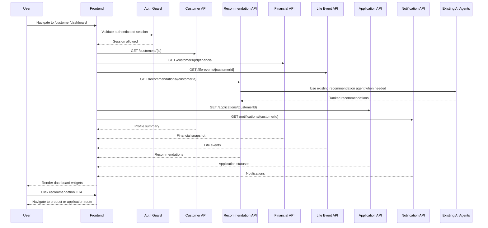

# Section 6: Dashboard Architecture

## Section Metadata

Section: 6 - Dashboard Architecture  
Version: 1.0.0  
Status: Documentation only  
Dependencies: Sections 1-5  
Extends: Existing BankMate AI backend architecture  
Modifications: None to backend, APIs, database, Redis, Kafka, AI agents, business logic, routing, layout, React, TypeScript, or CSS

## Compliance Declaration

- Backend architecture: unchanged
- Database schema: unchanged
- API endpoints: unchanged, only mapped
- AI agents: unchanged, only consumed
- Redis strategy: unchanged, only referenced
- Kafka events: unchanged, only referenced
- Authentication: unchanged from Section 4
- Routing: unchanged from Section 2
- Layout: unchanged from Section 3
- Customer journey: unchanged from Section 5
- Documentation only: confirmed
- No React code: confirmed
- No TypeScript code: confirmed
- No CSS code: confirmed

## 6.1 Dashboard Architecture Overview

The BankMate AI dashboard is the primary authenticated command center for customer engagement, conversion, and digital adoption. It surfaces personalized insights, life-event context, recommendations, application status, financial health, goals, product portfolio, communication nudges, and next best actions.

Dashboard objectives:

- Surface AI-generated hyper-personalized product recommendations.
- Display life-event-driven financial insights.
- Drive product conversion through contextual CTAs.
- Track customer financial goals and progress.
- Communicate through push, SMS, email, WhatsApp, and voice channels.
- Present onboarding completion nudges.
- Show real-time application status.
- Enable digital banking adoption through guided quick actions.

Dashboard principles:

- AI-first surface: widgets are AI-aware and consume existing agents.
- Life-event driven: detected life events influence widget priority.
- Customer-type aware: content adapts to salaried, self-employed, student, senior, and NRI segments.
- Conversion optimized: every recommendation has one clear primary CTA.
- Progressive disclosure: dashboard shows summaries and routes to feature pages for depth.
- Offline resilient: dashboard data uses stale-while-revalidate behavior over existing cache strategy.

## Role-Based Dashboard Access

Customer:

- Route: `/customer/dashboard`
- Layout: `CustomerLayout`
- Data scope: own profile, life events, recommendations, products, applications, KYC, goals, transactions, notifications

Admin:

- Route: `/admin/dashboard`
- Layout: `AdminLayout`
- Data scope: platform metrics, customer management, product configuration, monitoring
- Section 6 references admin structurally only

Relationship Manager:

- Route: `/rm/dashboard`
- Layout: `RMLayout`
- Data scope: assigned customers, leads, tasks, appointments, performance
- Section 6 references RM structurally only

## API Integration Overview

| Widget | Primary API | Cache |
| --- | --- | --- |
| Welcome Area | `GET /customers/{id}` | Redis 5m |
| Financial Snapshot | `GET /customers/{id}/financial` | Redis 15m |
| Life Events Banner | `GET /life-events/{customerId}` | Redis 10m |
| AI Recommendations | `GET /recommendations/{customerId}` | Redis 10m |
| Goal Tracker | `GET /customers/{id}/goals` | Redis 10m |
| Recent Activity | `GET /transactions/{customerId}?limit=5` | Redis 5m |
| Quick Actions | `GET /customers/{id}` | Redis 5m |
| Notifications | `GET /notifications/{customerId}` | Redis 2m |
| Application Status | `GET /applications/{customerId}` | Redis 5m |
| Financial Health Score | `GET /customers/{id}/financial` | Redis 15m |
| Product Portfolio | `GET /products/customer/{id}` | Redis 10m |

## AI Agent Mapping

| Dashboard Section | AI Agent | Trigger |
| --- | --- | --- |
| Recommendation Cards | RecommendationEngine | Dashboard load |
| Life Event Banner | LifeEventDetector | Background event or dashboard refresh |
| Financial Health Insights | FinancialAnalysisAgent | Financial data load |
| Goal Suggestions | GoalDiscoveryAgent | Goals widget load |
| Onboarding Nudge | OnboardingAgent | Profile incomplete |
| Communication Nudges | CommunicationAgent | Customer engagement events |
| Next Best Action | NextBestActionAgent | Dashboard refresh |
| Chat Suggestions | ConversationalAgent | Chat entry or dashboard prompt |

No new AI agents are introduced.

## 6.2 Customer Dashboard

Customer dashboard widgets:

1. Welcome Area
2. Financial Snapshot
3. Life Events Banner
4. AI Recommendation Center
5. Goal Tracker
6. Recent Activity
7. Quick Actions
8. Notification Summary
9. Application Status
10. Financial Health Score

Layout contract:

- Desktop: multi-column widget grid with AI Recommendation Center as the primary conversion area.
- Tablet: two-column grid with priority widgets first.
- Mobile: single-column stacked widgets with quick actions near the top.
- All widgets route to existing feature pages for deeper workflows.

## 6.2.1 Welcome Area

Purpose:

- Greet the customer by name.
- Surface onboarding state, customer type, KYC status, and next best action.
- Show a concise summary of the customer's banking journey.

Primary route exits:

- `/customer/profile`
- `/customer/onboarding`
- `/customer/kyc`
- `/chat`

States:

- Complete profile
- Incomplete profile
- KYC pending
- KYC rejected
- First login
- Returning customer

## 6.2.2 Financial Snapshot

Purpose:

- Show high-level financial data such as income band, savings trend, liabilities, credit profile, and affordability.
- Avoid showing sensitive values unless authenticated and authorized.

Route exits:

- `/customer/profile/financial`
- `/customer/transactions`
- `/customer/products`

## 6.2.3 Life Events Banner

Purpose:

- Highlight detected or confirmed life events.
- Explain why the event matters financially.
- Route to related recommendations and action plans.

Route exits:

- `/customer/life-events`
- `/customer/recommendations`
- `/customer/products`

States:

- No life events
- Detected but unconfirmed
- Confirmed active event
- Dismissed event
- Completed event

## 6.2.4 AI Recommendation Center

Purpose:

- Primary conversion widget for personalized products.
- Show top-ranked recommendations with match score, reason, eligibility, affordability, and one clear CTA.

Recommendation card fields:

- Product name
- Product category
- Match score
- Why recommended
- Eligibility indicator
- Affordability indicator
- Primary CTA
- Secondary explainability route

CTA mapping:

- Apply now: `/customer/products/:productId/apply`
- View details: `/customer/products/:productId`
- Compare: `/customer/recommendations/compare`
- Ask AI: `/chat`

## 6.2.5 Goal Tracker

Purpose:

- Show active goals, target progress, contribution gap, and next suggested action.

Route exits:

- `/customer/goals`
- `/customer/goals/new`
- `/customer/goals/:goalId`

States:

- No goals
- On track
- Behind target
- Goal achieved
- Suggested goal available

## 6.2.6 Recent Activity

Purpose:

- Show last five transactions or account activities.
- Route to transaction history for full filtering and categorization.

Route exits:

- `/customer/transactions`
- `/customer/transactions/:transactionId`
- `/customer/transactions/categories`

## 6.2.7 Quick Actions

Purpose:

- Give customers fast access to common banking tasks.

Quick actions:

- Apply for product
- Upload KYC document
- Start chat
- Create goal
- View recommendations
- Review applications
- Change notification preferences

Route exits:

- `/customer/products`
- `/customer/kyc/upload`
- `/chat`
- `/customer/goals/new`
- `/customer/recommendations`
- `/customer/applications`
- `/customer/settings/notifications`

## 6.2.8 Notification Summary

Purpose:

- Show high-priority alerts and communication nudges.
- Avoid overwhelming the dashboard with full notification history.

Route exits:

- `/customer/notifications`
- `/customer/notifications/:notificationId`
- `/customer/settings/notifications`

## 6.2.9 Application Status

Purpose:

- Show active applications, current status, pending action, and next deadline.

Route exits:

- `/customer/applications`
- `/customer/applications/:appId`
- `/customer/applications/:appId/status`
- `/customer/applications/:appId/accept`

States:

- No applications
- Draft
- Submitted
- Under review
- More information required
- Approved
- Rejected
- Offer available

## 6.2.10 Financial Health Score

Purpose:

- Summarize financial wellness using existing financial profile and transaction signals.
- Provide explainable factors and suggested next actions.

Signals:

- Savings consistency
- Debt-to-income ratio
- Credit readiness
- Emergency fund
- Goal progress
- Product fit

Route exits:

- `/customer/profile/financial`
- `/customer/goals`
- `/customer/recommendations`

## 6.3 Widget Architecture

Each dashboard widget follows a shared interface:

- Title
- Description
- Data state
- Primary content
- Primary CTA
- Optional secondary action
- Empty state
- Loading state
- Error state
- Last updated timestamp where useful

Widget states:

- Loading
- Ready
- Empty
- Error
- Stale/offline

Widget rules:

- A widget owns its own loading and error state.
- A dashboard-level failure should not blank the whole page.
- Each widget must have a meaningful empty state.
- Each widget should expose one dominant action.
- Widgets should be self-contained for future micro-frontend extraction.

## 6.4 AI Recommendation Center Full Page

Route:

- `/customer/recommendations`

Purpose:

- Expand recommendation cards into a full discovery and comparison workspace.

Expected capabilities:

- Filter by product category.
- Sort by match score, affordability, rate, or urgency.
- Explain recommendation reason.
- Compare selected recommendations.
- Start application from eligible products.
- Ask AI for clarification.

## 6.5 Financial Health Dashboard

Route:

- `/customer/profile/financial`

Purpose:

- Provide a deeper view of financial profile, affordability, risk, and readiness.

Sections:

- Income and cashflow
- Liabilities
- Spending pattern
- Savings readiness
- Credit readiness
- Health score explanation
- Recommended improvements

## 6.6 Goal Tracking Dashboard

Route:

- `/customer/goals`

Purpose:

- Show all active and completed financial goals.

Capabilities:

- Create goal
- Edit goal
- View progress
- View contribution plan
- Show AI-suggested goals
- Connect product recommendations to goals

## 6.7 Product Portfolio Dashboard

Route:

- `/customer/products`

Purpose:

- Show eligible, owned, and recommended products.

Capabilities:

- Product category browsing
- Eligibility indicators
- Portfolio holdings
- Comparison
- Apply CTA
- Calculator entry point where relevant

## 6.8 Smart Communication Center

Routes:

- `/customer/notifications`
- `/customer/settings/notifications`
- `/customer/voice`

Purpose:

- Bring together important alerts, nudges, reminders, campaigns, and consented voice communication.

Communication channels:

- In-app
- Email
- SMS
- WhatsApp
- Voice

Rules:

- Respect notification preferences.
- Respect consent and calling windows.
- High-priority service alerts override marketing preferences where legally permitted.

## 6.9 Dashboard States

Dashboard-level states:

- Initial loading
- Loaded
- Partial error
- Empty/new customer
- Offline/stale

Initial loading:

- Show page-level skeletons or loading layout.

Loaded:

- Render all widgets with their own data states.

Partial error:

- Render successful widgets and show inline error recovery for failed widgets.

Empty/new customer:

- Prioritize onboarding, profile completion, goals, and first recommendation generation.

Offline/stale:

- Show cached data with a clear stale indicator.
- Disable unsafe actions that require live data.

## 6.10 Responsive Behaviour

Mobile:

- Single-column dashboard.
- Bottom navigation from Section 3 remains primary.
- Quick actions should be easy to reach.
- Recommendation cards stack vertically.

Tablet:

- Two-column grid.
- AI Recommendation Center may span full width.

Desktop:

- Sidebar navigation plus multi-column widget layout.
- Primary conversion widgets receive larger grid spans.

Wide desktop:

- Preserve readable content width.
- Avoid stretching dense cards beyond useful scan width.

## 6.11 Accessibility

Target:

- WCAG 2.2 AA

Requirements:

- Widgets use semantic section headings.
- Interactive elements are keyboard reachable.
- Focus indicators are visible.
- Status changes are announced where relevant.
- Loading indicators have accessible text.
- Errors include recovery actions.
- Color is not the only status signal.
- Touch targets remain usable on mobile.
- Charts must include textual summaries.

## 6.12 Dashboard Analytics

Events:

- `dashboard_loaded`
- `dashboard_widget_loaded`
- `dashboard_widget_error`
- `recommendation_viewed`
- `recommendation_cta_clicked`
- `quick_action_clicked`
- `life_event_confirmed`
- `goal_card_clicked`
- `application_status_clicked`
- `financial_health_viewed`

Funnels:

- Dashboard load to recommendation view
- Recommendation view to product detail
- Recommendation view to application start
- Onboarding nudge to profile completion
- KYC nudge to KYC upload
- Application status view to offer acceptance

KPIs:

- Dashboard engagement rate
- Recommendation click-through rate
- Application conversion rate
- Profile completion rate
- KYC completion rate
- Goal creation rate
- Digital adoption rate

## 6.13 Mermaid Dashboard Diagram

## 6.14 Dashboard Sequence Diagram

## 6.15 Future Scalability

Widget extensibility:

- New widgets are additive.
- Widgets remain isolated and self-contained.
- Visibility can be controlled through feature flags.

Personalization:

- Existing AI agents may influence widget order or priority.
- Customer type, life events, and engagement history can personalize dashboard layout.

Micro-frontend readiness:

- Widget boundaries should remain explicit.
- Widget state and data loading should be isolated.

PWA dashboard:

- Static assets can be cached through existing service worker setup.
- Cached dashboard data can support offline read-only states.

Additional languages:

- Add locale files under `/public/locales/{lang}`.
- Register supported language in existing i18n setup.

White-label support:

- Use existing theme variables.
- Use app config for brand-level metadata.
- Use feature flags for widget visibility.

## Section 6 Deliverables Checklist

- 6.1 Dashboard Architecture Overview: complete
- 6.2 Customer Dashboard with 10 widgets: complete
- 6.3 Widget Architecture and states: complete
- 6.4 AI Recommendation Center full page contract: complete
- 6.5 Financial Health Dashboard contract: complete
- 6.6 Goal Tracking Dashboard contract: complete
- 6.7 Product Portfolio Dashboard contract: complete
- 6.8 Smart Communication Center contract: complete
- 6.9 Dashboard States: complete
- 6.10 Responsive Behaviour: complete
- 6.11 Accessibility: complete
- 6.12 Dashboard Analytics: complete
- 6.13 Mermaid Dashboard Diagram: complete
- 6.14 Dashboard Sequence Diagram: complete
- 6.15 Future Scalability: complete
