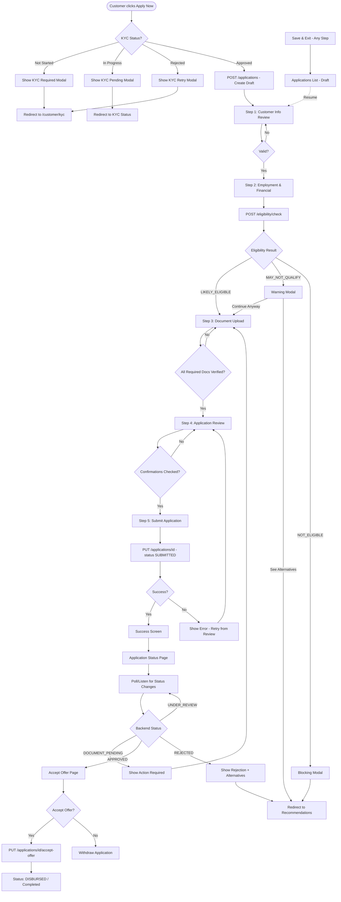
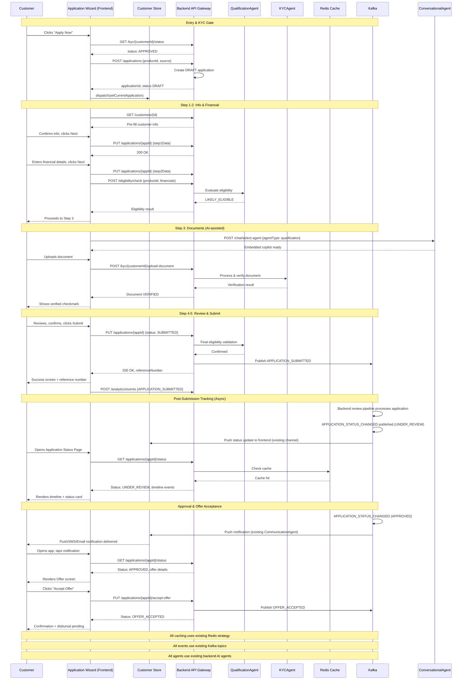

SECTION 9: APPLICATION JOURNEY, DIGITAL APPLICATION & APPLICATION TRACKING EXPERIENCE

════════════════════════════════════════════════════════════════
📋 SECTION METADATA
════════════════════════════════════════════════════════════════

Section:       9 - Application Journey, Digital Application & Application Tracking Experience
Version:       1.0.0
Status:        DRAFT - PENDING APPROVAL
Dependencies:  Sections 1–8 (All Approved)
Extends:       Existing BankMate AI Backend Architecture
Modifications: NONE to existing backend/business logic

════════════════════════════════════════════════════════════════
⚠️ COMPLIANCE DECLARATION
════════════════════════════════════════════════════════════════

✅ Backend Architecture:      UNCHANGED
✅ Database Schema:           UNCHANGED
✅ API Endpoints:             UNCHANGED (only mapped)
✅ AI Agents:                 UNCHANGED (only consumed)
✅ Kafka Events:              UNCHANGED (only consumed)
✅ Redis Strategy:            UNCHANGED (only referenced)
✅ Business Logic:            UNCHANGED
✅ Authentication:            UNCHANGED (Section 4)
✅ Routing:                   UNCHANGED (Section 2)
✅ Layout Architecture:       UNCHANGED (Section 3)
✅ Dashboard Architecture:    UNCHANGED (Section 6)
✅ AI Copilot:                UNCHANGED (Section 7)
✅ Recommendation Engine:     UNCHANGED (Section 8)

✅ Documentation Only: Confirmed
✅ No React Code: Confirmed
✅ No TypeScript Code: Confirmed
✅ No CSS Code: Confirmed

════════════════════════════════════════════════════════════════
🎯 SECTION OVERVIEW
════════════════════════════════════════════════════════════════

Section 9 defines the complete frontend specification for the entire
banking application lifecycle — from the moment a customer clicks
"Apply Now" on a recommendation or product card (Section 8) through
multi-step application completion, document submission, KYC
integration (existing KYC Agent), review, submission, and full
post-submission tracking until the application reaches a terminal
state (Approved, Rejected, or Disbursed/Completed).

This section is the direct continuation of:
  - Section 8.13 (Product CTA Behaviour — Apply Now decision tree)
  - Section 4 (Authentication guards — Auth, KYC guards)
  - Section 2.1.3 (/customer/applications/* routes, already defined)
  - Section 6 (Dashboard Application Status widget)
  - Section 7 (AI Copilot — QualificationAgent embedded assistance)

All AI interactions in this section map exclusively to the
pre-existing AI agents defined in the approved backend blueprint:
  - QualificationAgent
  - KYCAgent
  - FinancialAnalysisAgent
  - ConversationalAgent
  - NextBestActionAgent
  - CommunicationAgent

All application API calls use the existing endpoints already
referenced in Section 2 (Routing) and Section 8 (Recommendation):
  - POST   /applications
  - GET    /applications/{customerId}
  - GET    /applications/{appId}
  - PUT    /applications/{appId}
  - GET    /applications/{appId}/status
  - PUT    /applications/{appId}/accept-offer
  - POST   /kyc/{customerId}/upload-document
  - GET    /kyc/{customerId}/status
  - GET    /customers/{id}
  - GET    /customers/{id}/financial
  - POST   /chat/select-agent
  - POST   /chat/send-message
  - GET    /notifications/{customerId}

No new endpoints are introduced anywhere in this section.

════════════════════════════════════════════════════════════════
9.1 APPLICATION ARCHITECTURE
════════════════════════════════════════════════════════════════

9.1.1 ARCHITECTURE OVERVIEW
APPLICATION SYSTEM — FRONTEND LAYER
════════════════════════════════════════════════════════════════

The frontend application experience operates as a pure consumer
of the existing backend application processing pipeline. The frontend:

✅ Collects customer input across a multi-step wizard
✅ Persists draft state locally and remotely (resumable applications)
✅ Triggers real-time eligibility re-validation via QualificationAgent
✅ Triggers KYC document upload via existing KYC Agent APIs
✅ Submits finalized applications via existing /applications endpoint
✅ Polls / subscribes to status changes via existing status APIs
✅ Renders AI-assisted guidance via ConversationalAgent at each step
✅ Fires Kafka-consumed analytics events per interaction

❌ Does NOT perform credit decisioning on the frontend
❌ Does NOT compute eligibility on the frontend
❌ Does NOT validate KYC documents on the frontend (visual pre-check only)
❌ Does NOT store sensitive documents client-side beyond upload buffer
❌ Does NOT introduce a new application state machine on the backend
   (frontend state machine mirrors, never replaces, backend application
   status)

9.1.2 DATA FLOW ARCHITECTURE
APPLICATION DATA FLOW
════════════════════════════════════════════════════════════════

Customer Clicks "Apply Now" (Section 8.13)
  │
  ▼
Frontend: Check existing KYC status (Section 4 KYCGuard)
  │
  ├─ KYC Approved      → Proceed to Application Wizard
  ├─ KYC Not Started   → Redirect to /customer/kyc (Section 2.1.3)
  └─ KYC In Progress   → Show "KYC In Progress" interstitial
  │
  ▼
Frontend: POST /applications  (creates DRAFT application)
  │
  ▼
Backend:
  ├── Creates application record (existing schema, unchanged)
  ├── Pre-fills from existing customer profile (GET /customers/{id})
  ├── Pre-fills from existing financial profile
  │     (GET /customers/{id}/financial)
  ├── Links to source recommendationId / productId (Section 8)
  └── Returns applicationId + DRAFT status
  │
  ▼
Frontend: Multi-Step Wizard (9.3)
  │
  ├── Step 1: Customer Information Review (9.4)
  ├── Step 2: Employment & Financial Details (9.5)
  ├── Step 3: Document Upload (9.6)
  ├── Step 4: Application Review (9.9)
  └── Step 5: Submission (9.10)
  │
  ▼
At every step:
  ├── PUT /applications/{appId}  (saves step data, draft autosave)
  ├── POST /chat/select-agent {agentType: "qualification"}
  │     (AI Copilot embedded assistance — Section 7.1.1 Mode 3)
  └── Kafka: APPLICATION_STEP_COMPLETED (existing event, consumed only)
  │
  ▼
Final Submission: PUT /applications/{appId} {status: "SUBMITTED"}
  │
  ▼
Backend:
  ├── Kafka: APPLICATION_SUBMITTED published
  ├── QualificationAgent: Final eligibility re-check
  ├── KYCAgent: Confirms KYC linkage
  └── Application enters existing backend processing pipeline
  │
  ▼
Frontend: Redirect to /customer/applications/{appId}/status (9.11)
  │
  ▼
Post-Submission Tracking (Async, Kafka-driven):
  ├── Kafka: APPLICATION_STATUS_CHANGED (existing topic)
  ├── NotificationAgent / CommunicationAgent → Push/SMS/Email/WhatsApp
  ├── Frontend: GET /applications/{appId}/status (polling fallback)
  └── Frontend: Real-time update via existing notification channel

9.1.3 API MAPPING TABLE
APPLICATION API ENDPOINTS (EXISTING)
════════════════════════════════════════════════════════════════

Action                       | Method | Endpoint                                  | Trigger
──────────────────────────────┼────────┼────────────────────────────────────────────┼─────────────────────────
Create draft application      | POST   | /applications                             | "Apply Now" click
Fetch applications list       | GET    | /applications/{customerId}                | Applications page load
Fetch single application      | GET    | /applications/{appId}                     | Wizard step load / resume
Update application (draft)    | PUT    | /applications/{appId}                     | Step autosave / submit
Fetch application status      | GET    | /applications/{appId}/status              | Status page load / poll
Accept offer                  | PUT    | /applications/{appId}/accept-offer        | "Accept Offer" CTA
Fetch customer profile        | GET    | /customers/{id}                           | Step 1 pre-fill
Fetch financial profile       | GET    | /customers/{id}/financial                 | Step 2 pre-fill
Upload KYC document           | POST   | /kyc/{customerId}/upload-document         | Step 3 upload
Fetch KYC status               | GET    | /kyc/{customerId}/status                  | KYC guard check / Step 3
Re-check eligibility           | POST   | /eligibility/check                        | Step 2 completion (Section 8)
Select AI agent                | POST   | /chat/select-agent                        | Embedded copilot mount
Send chat message              | POST   | /chat/send-message                        | AI-assisted form filling
Fetch notifications            | GET    | /notifications/{customerId}               | Status page / badge
Log analytics event            | POST   | /analytics/events                         | Every interaction (Section 8 pattern)

All endpoints above are already defined in Section 2 (Routing) and
Section 8 (Recommendation Architecture). No new endpoint is introduced.

9.1.4 STATE TREE (APPLICATION STORE)
APPLICATIONS STORE SHAPE (applications.store.ts — Section 1.1)
════════════════════════════════════════════════════════════════

applications.store
  ├── list: Application[]                  (GET /applications/{customerId})
  ├── currentApplication: Application | null
  ├── wizardStep: number                   (1–5, persisted)
  ├── wizardData: {
  │     customerInfo: {...},               (Step 1)
  │     employmentFinancial: {...},        (Step 2)
  │     documents: DocumentRef[],          (Step 3)
  │     reviewConfirmed: boolean          (Step 4)
  │   }
  ├── autosaveStatus: 'idle' | 'saving' | 'saved' | 'error'
  ├── eligibilitySnapshot: EligibilityResult | null   (Section 8.8 reused)
  ├── kycStatus: 'not_started' | 'in_progress' | 'approved' | 'rejected'
  ├── statusTimeline: TimelineEvent[]      (9.12)
  ├── loading: boolean
  ├── error: Error | null
  └── lastFetched: timestamp

This store is additive to the existing applications.store.ts file
declared in Section 1.1. No existing store keys are renamed or removed.

9.1.5 APPLICATION STATUS STATE MACHINE
BACKEND-DRIVEN STATUS STATES (Frontend mirrors, never sets directly)
════════════════════════════════════════════════════════════════

State            | Description                              | Customer-Facing Label
──────────────────┼───────────────────────────────────────────┼──────────────────────────
DRAFT             | Wizard in progress, not submitted         | "Draft — Continue Application"
SUBMITTED         | Submitted, awaiting processing            | "Submitted"
UNDER_REVIEW       | Backend qualification/credit review       | "Under Review"
DOCUMENT_PENDING   | Additional documents requested            | "Action Required"
APPROVED          | Application approved, offer generated     | "Approved"
OFFER_ACCEPTED     | Customer accepted the offer                | "Offer Accepted"
DISBURSED          | Funds disbursed / product activated        | "Completed"
REJECTED           | Application rejected                       | "Not Approved"
WITHDRAWN          | Customer withdrew application              | "Withdrawn"
EXPIRED            | Draft expired without submission           | "Expired"

Transitions are entirely backend-controlled (existing business logic,
Section 0 TechSpec). The frontend ONLY reads this state via
GET /applications/{appId}/status and renders accordingly. The frontend
state machine (9.1.4) governs ONLY wizard navigation, not application
status.

Frontend Wizard States (separate from backend Application Status):
──────────────────────────────────────────────────────────────────
IDLE → LOADING_DRAFT → STEP_1 → STEP_2 → STEP_3 → STEP_4 →
SUBMITTING → SUBMITTED_SUCCESS | SUBMITTED_ERROR

Transitions:
  IDLE → LOADING_DRAFT (on wizard mount, checks for existing draft)
  LOADING_DRAFT → STEP_1 (no draft found, or draft loaded at step 1)
  LOADING_DRAFT → STEP_N (draft found, resumes at saved step — 9.15)
  STEP_N → STEP_N+1 (validation passed, autosave success)
  STEP_N → STEP_N (validation failed, show inline errors)
  STEP_4 → SUBMITTING (final "Submit Application" click)
  SUBMITTING → SUBMITTED_SUCCESS (201/200 response)
  SUBMITTING → SUBMITTED_ERROR (4xx/5xx response)
  SUBMITTED_ERROR → STEP_4 (user retries from review step)

9.1.6 NAVIGATION INTEGRATION
APPLICATION NAVIGATION MAPPING (extends Section 2.1.3)
════════════════════════════════════════════════════════════════

Entry Points (into Section 9):
  ├── /customer/products/:productId/apply   → New Application Wizard
  ├── /customer/recommendations/:recId      → "Apply Now" CTA (Section 8.4)
  └── /customer/applications/new            → Manual entry point

Wizard Routes (already declared in Section 2.1.3, unmodified):
  ├── /customer/products/:productId/apply        → ApplicationForm (Step 1–4)
  └── /customer/applications/new                  → NewApplicationPage

Tracking Routes (already declared in Section 2.1.3, unmodified):
  ├── /customer/applications                      → ApplicationsPage (list)
  ├── /customer/applications/:appId                → ApplicationDetailsPage
  ├── /customer/applications/:appId/status          → ApplicationStatusPage
  └── /customer/applications/:appId/accept           → AcceptOfferPage

Exit Points (from Section 9):
  ├── /customer/dashboard                  → On submission success ("Go to Dashboard")
  ├── /customer/kyc                        → If KYC incomplete (guard redirect)
  ├── /customer/recommendations            → "Explore other products" (rejection state)
  └── /customer/chat                       → "Talk to AI Copilot" (any error state)

════════════════════════════════════════════════════════════════
9.2 APPLICATION ENTRY POINTS
════════════════════════════════════════════════════════════════

9.2.1 ENTRY POINT CATALOGUE
ALL PATHS THAT LEAD INTO THE APPLICATION WIZARD
════════════════════════════════════════════════════════════════

Entry Point 1: Recommendation Card "Apply Now" (Primary)
──────────────────────────────────────────────────────────
Source:      RecommendationCard (Section 8.4) primary CTA
Pre-fill:    recommendationId, productId, matchScore carried forward
API Call:    POST /applications {productId, recommendationId, source: "recommendation"}
Guard Check: AuthGuard + KYCGuard (Section 4)
Analytics:   APPLY_NOW_CLICKED (Section 8.13, existing event)

Entry Point 2: Product Detail Page "Apply Now" (Secondary)
──────────────────────────────────────────────────────────
Source:      ProductDetailsPage (Section 8.12) sticky sidebar CTA
Pre-fill:    productId only (no recommendation context)
API Call:    POST /applications {productId, source: "product_catalog"}
Guard Check: AuthGuard + KYCGuard (Section 4)
Analytics:   APPLY_NOW_CLICKED {source: "product_detail"}

Entry Point 3: Dashboard Quick Action (Tertiary)
──────────────────────────────────────────────────────────
Source:      Customer Dashboard Quick Actions widget (Section 6.2)
Pre-fill:    None — opens NewApplicationPage with product selector
API Call:    GET /products (catalog, Section 8.5) shown first
Guard Check: AuthGuard + KYCGuard (Section 4)
Analytics:   APPLY_NOW_CLICKED {source: "dashboard_quick_action"}

Entry Point 4: AI Copilot Suggested Action
──────────────────────────────────────────────────────────
Source:      Floating Copilot (Section 7.1.1) — NextBestActionAgent
             suggests "Apply for [Product]" inline button
Pre-fill:    productId from agent context
API Call:    POST /applications {productId, source: "ai_copilot"}
Guard Check: AuthGuard + KYCGuard (Section 4)
Analytics:   APPLY_NOW_CLICKED {source: "ai_copilot"}

Entry Point 5: Notification Deep Link
──────────────────────────────────────────────────────────
Source:      Push/SMS/Email/WhatsApp notification (existing
             CommunicationAgent campaigns)
Pre-fill:    productId or applicationId encoded in deep link
             (Section 2.5 Deep Linking Strategy, unmodified)
API Call:    Resolves to either new application or resumes draft
Guard Check: AuthGuard + KYCGuard (Section 4)
Analytics:   APPLY_NOW_CLICKED {source: "notification_deeplink"}

9.2.2 KYC GATE LOGIC AT ENTRY
PRE-WIZARD KYC CHECK (uses existing KYCGuard — Section 4)
════════════════════════════════════════════════════════════════

On Any Entry Point Triggered:
  │
  ▼
GET /kyc/{customerId}/status
  │
  ├─ status: "APPROVED"
  │     → Proceed directly to Application Wizard (9.3)
  │
  ├─ status: "NOT_STARTED"
  │     → Show interstitial modal:
  │         Title: "Quick Verification Needed"
  │         Body: "Before you apply, we need to verify your identity.
  │                This takes about 3 minutes."
  │         Primary CTA: "Start KYC" → /customer/kyc
  │         Secondary CTA: "Maybe Later" → returns to product page
  │
  ├─ status: "IN_PROGRESS"
  │     → Show interstitial modal:
  │         Title: "Verification In Progress"
  │         Body: "Your documents are being verified. We'll notify you
  │                once it's done — usually within 24 hours."
  │         Primary CTA: "Check Status" → /customer/kyc/status
  │         Secondary CTA: "Close"
  │
  └─ status: "REJECTED"
        → Show interstitial modal:
            Title: "Verification Needs Attention"
            Body: "There was an issue verifying your documents."
            Primary CTA: "Retry Verification" → /customer/kyc
            Secondary CTA: "Contact Support"

Draft Application Pre-Created Without KYC:
  The draft application (POST /applications) MAY be created before
  KYC completion, allowing the customer's Step 1–2 data to be saved.
  Document Upload (Step 3) and Submission (Step 5) remain blocked
  until KYC status is APPROVED. This reuses the existing KYCGuard
  pattern already defined for /customer/products/:productId/apply
  in Section 2.1.3.

════════════════════════════════════════════════════════════════
9.3 MULTI-STEP APPLICATION WIZARD
════════════════════════════════════════════════════════════════

9.3.1 WIZARD STRUCTURE
WIZARD CONTAINER SPECIFICATION
════════════════════════════════════════════════════════════════

Layout:      CustomerLayout (Section 3.1) with wizard sub-shell
Component:   ApplicationForm.tsx (Section 1.1, already scaffolded)
Route:       /customer/products/:productId/apply
Guard:       Auth, KYC (Section 2.1.3)

Structure:
┌─────────────────────────────────────────────────────────────┐
│  Customer Header (Section 3.3.1)                            │
├─────────────────────────────────────────────────────────────┤
│  Stepper:  ① Customer Info → ② Financial → ③ Documents →    │
│            ④ Review → ⑤ Submit                              │
├─────────────────────────────────────────────────────────────┤
│                                                               │
│   ┌──────────────────────────────┐   ┌──────────────────┐   │
│   │                               │   │  Embedded         │   │
│   │   Active Step Content         │   │  Copilot Panel    │   │
│   │   (Section 9.4 – 9.10)        │   │  (Section 7.1.1   │   │
│   │                               │   │  Mode 3)           │   │
│   │                               │   │  320px desktop     │   │
│   └──────────────────────────────┘   └──────────────────┘   │
│                                                               │
├─────────────────────────────────────────────────────────────┤
│  [ Back ]                          Autosave: Saved ✓ [ Next ]│
└─────────────────────────────────────────────────────────────┘

9.3.2 STEPPER COMPONENT SPECIFICATION
Reuses Stepper.tsx (Section 1.1, shared/components/navigation/)
════════════════════════════════════════════════════════════════

Step States:
  ├── COMPLETED:  Checkmark icon, green, clickable (navigate back)
  ├── ACTIVE:     Numbered circle, brand color, bold label
  ├── UPCOMING:   Numbered circle, gray, not clickable
  └── ERROR:      Numbered circle, red, indicates validation issue

Step Labels:
  1. Customer Info
  2. Financial Details
  3. Documents
  4. Review
  5. Submit

Mobile Behaviour:
  ├── Stepper collapses to: "Step 2 of 5: Financial Details"
  ├── Progress bar shown beneath (percentage fill)
  └── Tap step label → expand full stepper as bottom sheet

9.3.3 WIZARD NAVIGATION RULES
NAVIGATION CONSTRAINTS
════════════════════════════════════════════════════════════════

Forward Navigation ("Next"):
  ├── Requires: Current step validation passed
  ├── Action: PUT /applications/{appId} {step data}
  ├── On Success: autosaveStatus = 'saved', advance wizardStep
  └── On Failure: Show inline error, autosaveStatus = 'error', stay on step

Backward Navigation ("Back" / Stepper click on completed step):
  ├── No validation required (always allowed)
  ├── No API call required (data already saved)
  └── Loads previously saved wizardData for that step

Direct URL Navigation (e.g., browser back button, refresh):
  ├── On wizard mount: GET /applications/{appId}
  ├── Resumes at: application.lastCompletedStep + 1
  └── Cannot skip ahead via URL manipulation (route guard validates
      backend-confirmed step completion, not just local state)

Exit Navigation ("Save & Exit"):
  ├── Always available in header
  ├── Triggers final autosave: PUT /applications/{appId}
  ├── Redirects to: /customer/applications (list view)
  └── Application remains in DRAFT status (resumable — Section 9.15)

9.3.4 AUTOSAVE BEHAVIOUR
AUTOSAVE SPECIFICATION
════════════════════════════════════════════════════════════════

Trigger Points:
  ├── On field blur (debounced 800ms)
  ├── On step "Next" click (immediate, blocking)
  ├── On "Save & Exit" click (immediate, blocking)
  └── Every 60 seconds while step is active (background, non-blocking)

API Call: PUT /applications/{appId} {step, partialData}

Visual Indicator (Header area):
  ┌────────────────────────┐
  │ ⏳ Saving...            │   (autosaveStatus: 'saving')
  └────────────────────────┘
  ┌────────────────────────┐
  │ ✓ Saved                │   (autosaveStatus: 'saved')
  └────────────────────────┘
  ┌────────────────────────┐
  │ ⚠ Couldn't save — Retry │   (autosaveStatus: 'error')
  └────────────────────────┘

Conflict Handling:
  IF concurrent edit detected (e.g., same application open in two tabs):
    Backend returns 409 Conflict
    Frontend shows: "This application was updated elsewhere. Reload?"
    Action: GET /applications/{appId} (refetch latest), discard local diff

════════════════════════════════════════════════════════════════
9.4 CUSTOMER INFORMATION REVIEW (WIZARD STEP 1)
════════════════════════════════════════════════════════════════

9.4.1 STEP OVERVIEW
PURPOSE: Confirm pre-filled identity data is accurate before proceeding
════════════════════════════════════════════════════════════════

Data Source: GET /customers/{id}  (existing endpoint, Section 2.1.3)
Pre-fill Fields:
  ├── Full Name           (read-only, edit via /customer/profile/edit)
  ├── Date of Birth        (read-only)
  ├── PAN Number            (masked, read-only)
  ├── Mobile Number         (read-only, verified badge if OTP-confirmed)
  ├── Email                 (read-only, verified badge if confirmed)
  ├── Current Address        (editable inline for this application only)
  └── Customer Type          (badge display — Salaried/Self-Employed/etc.,
                              Section 5 customer type system, unchanged)

9.4.2 LAYOUT SPECIFICATION
Structure:
┌─────────────────────────────────────────────────────────────┐
│  Confirm Your Details                                        │
│  We've pre-filled this from your profile. Please review.     │
│                                                                │
│  ┌──────────────┐  Priya Sharma                              │
│  │   Avatar      │  priya@email.com  ✓ Verified               │
│  └──────────────┘  +91-XXXXX-43210  ✓ Verified                │
│                     Salaried Employee                         │
│                                                                │
│  Current Address                                              │
│  ┌──────────────────────────────────────────────────────┐    │
│  │ [Editable address fields]                              │    │
│  └──────────────────────────────────────────────────────┘    │
│                                                                │
│  ☐ This is my current residential address                    │
│                                                                │
│  Not your details? [Update Profile] (opens in new tab,        │
│  /customer/profile/edit — Section 2.1.3, does not interrupt   │
│  wizard)                                                       │
└─────────────────────────────────────────────────────────────┘

9.4.3 VALIDATION RULES
Field           | Rule                              | Error Message
─────────────────┼────────────────────────────────────┼──────────────────────────
Address Line 1   | Required, max 200 chars            | "Address is required"
City             | Required                            | "City is required"
State            | Required, dropdown (existing list)  | "State is required"
PIN Code         | Required, 6-digit numeric            | "Enter a valid PIN code"
Confirmation     | Checkbox must be checked              | "Please confirm your address"

9.4.4 EDGE CASES
Scenario: Profile data incomplete (e.g., missing PAN)
  → Show banner: "Some details are missing. [Complete Profile] to continue."
  → "Next" button disabled until required profile fields exist
  → Links to /customer/profile/edit (existing route)

Scenario: Customer type not yet detected
  → Show banner: "We're still learning about you."
  → Fallback to generic application flow (no customer-type-specific fields)
  → QualificationAgent still evaluates using available data

════════════════════════════════════════════════════════════════
9.5 EMPLOYMENT & FINANCIAL DETAILS (WIZARD STEP 2)
════════════════════════════════════════════════════════════════

9.5.1 STEP OVERVIEW
PURPOSE: Collect/confirm employment and financial data for eligibility
════════════════════════════════════════════════════════════════

Data Source: GET /customers/{id}/financial (existing endpoint)
API Submit:  PUT /applications/{appId} {employmentFinancial: {...}}
Re-validate: POST /eligibility/check (existing, Section 8.1.3) — fired
             on step completion to refresh eligibility status live

9.5.2 FIELD SETS BY CUSTOMER TYPE
Reuses existing customer-types.constants.ts (Section 1.1)
════════════════════════════════════════════════════════════════

SALARIED:
  ├── Employer Name
  ├── Designation
  ├── Monthly Net Salary
  ├── Years at Current Employer
  ├── Salary Account Bank (existing or BankMate)
  └── Employment Type (Permanent / Contract)

SELF-EMPLOYED:
  ├── Business Name
  ├── Business Type / Industry
  ├── Years in Business
  ├── Annual Turnover
  ├── GST Registration Number (optional)
  └── ITR Filed for Last 2 Years (Yes/No)

STUDENT:
  ├── Institution Name
  ├── Course & Year
  ├── Co-Applicant Required (Yes/No — triggers co-applicant fields)
  └── Co-Applicant Income (if applicable)

SENIOR:
  ├── Pension Source
  ├── Monthly Pension Amount
  └── Other Income Sources (optional)

NRI:
  ├── Country of Residence
  ├── Employer / Business (abroad)
  ├── NRE/NRO Account Status
  └── Annual Income (in INR equivalent)

9.5.3 LIVE AFFORDABILITY PREVIEW
Reuses AffordabilityIndicator (Section 8.4) — Read-only preview
════════════════════════════════════════════════════════════════

Behaviour:
  ├── As customer fills income fields (debounced 1000ms):
  │     Frontend computes a LOCAL preview using the same display
  │     formula already used in Section 8 AffordabilityIndicator
  │     (display-only; does NOT replace backend FinancialAnalysisAgent
  │     computation)
  ├── Label: "Estimated EMI affordability — confirmed on next step"
  └── Final authoritative affordability comes from
        POST /eligibility/check response (server-computed)

9.5.4 ELIGIBILITY RE-CHECK ON STEP COMPLETION
════════════════════════════════════════════════════════════════

On "Next" Click:
  │
  ▼
PUT /applications/{appId} {employmentFinancial}
  │
  ▼
POST /eligibility/check {productId, customerId, updatedFinancials}
  │
  ├─ Result: LIKELY_ELIGIBLE
  │     → Proceed to Step 3 (Documents)
  │
  ├─ Result: MAY_NOT_QUALIFY
  │     → Show non-blocking warning modal (reuses Section 8.8 pattern):
  │         "Based on these details, approval odds are lower."
  │         Primary CTA: "Continue Anyway" → Step 3
  │         Secondary CTA: "See Alternative Products" →
  │           /customer/recommendations
  │
  └─ Result: NOT_ELIGIBLE
        → Show blocking modal:
            "This product isn't a fit based on current details."
            Primary CTA: "View Better-Matched Products" →
              /customer/recommendations
            Secondary CTA: "Save as Draft & Exit"

9.5.5 VALIDATION RULES
Field                  | Rule                          | Error Message
────────────────────────┼─────────────────────────────────┼──────────────────────────
Monthly Income/Salary   | Required, numeric, > 0           | "Enter a valid income amount"
Years at Employer       | Required, numeric, 0–60          | "Enter valid years of experience"
Business Turnover       | Required for self-employed        | "Enter annual turnover"
Co-Applicant Income     | Required if co-applicant flagged   | "Co-applicant income is required"

════════════════════════════════════════════════════════════════
9.6 DOCUMENT UPLOAD EXPERIENCE (WIZARD STEP 3)
════════════════════════════════════════════════════════════════

9.6.1 STEP OVERVIEW
PURPOSE: Collect KYC and supporting documents via existing KYC Agent
════════════════════════════════════════════════════════════════

Gate:        Blocked until KYC status === APPROVED (9.2.2) OR
             this step itself initiates KYC if not yet started
Components:  DocumentUpload.tsx, DocumentScanner.tsx, DocumentPreview.tsx
             (all already scaffolded — Section 1.1)
API:         POST /kyc/{customerId}/upload-document
             GET  /kyc/{customerId}/status

9.6.2 DOCUMENT CHECKLIST (DYNAMIC, PER PRODUCT TYPE)
Sourced from existing product configuration (unchanged backend)
════════════════════════════════════════════════════════════════

Common Documents (All Products):
  ├── ☐ PAN Card
  ├── ☐ Aadhaar Card (front + back)
  └── ☐ Recent Photograph

Salaried — Additional:
  ├── ☐ Last 3 Months Salary Slips
  ├── ☐ Last 6 Months Bank Statement
  └── ☐ Form 16 / Latest ITR

Self-Employed — Additional:
  ├── ☐ Last 2 Years ITR
  ├── ☐ Business Registration Proof
  └── ☐ Last 12 Months Bank Statement

Home Loan — Additional:
  ├── ☐ Property Documents
  ├── ☐ Sale Agreement (if applicable)
  └── ☐ NOC from Builder/Society (if applicable)

9.6.3 UPLOAD INTERFACE
Structure:
┌─────────────────────────────────────────────────────────────┐
│  Upload Documents                                             │
│  4 of 7 documents uploaded                                    │
│  ████████████░░░░░░░░  57%                                    │
│                                                                │
│  ┌────────────────────────────────────────┐                  │
│  │ ✓ PAN Card                    [View] [Replace] │            │
│  │ ✓ Aadhaar Card                [View] [Replace] │            │
│  │ ✓ Salary Slip (3 months)      [View] [Replace] │            │
│  │ ✓ Bank Statement              [View] [Replace] │            │
│  │ ○ Form 16 / ITR                [Upload]         │            │
│  │ ○ Recent Photograph            [Upload] [📷 Scan]│            │
│  │ ○ Address Proof                [Upload]         │            │
│  └────────────────────────────────────────┘                  │
│                                                                │
│  Accepted formats: PDF, JPG, PNG (max 5MB per file)            │
└─────────────────────────────────────────────────────────────┘

9.6.4 UPLOAD FLOW
════════════════════════════════════════════════════════════════

Step 1: Customer selects file or uses Document Scanner
  ├── File picker (native input) OR
  └── DocumentScanner.tsx (camera capture, existing component)

Step 2: Client-side pre-validation
  ├── File type check (PDF/JPG/PNG only)
  ├── File size check (max 5MB)
  └── Basic image quality heuristic (blur/brightness — visual hint only,
       NOT a backend validation substitute)

Step 3: Upload
  ├── POST /kyc/{customerId}/upload-document
  │     {documentType, file, applicationId}
  ├── Progress bar shown during upload
  └── Existing KYC Agent processes document (OCR, validation — backend,
       unchanged)

Step 4: Result
  ├─ Success → Document marked ✓, thumbnail shown
  ├─ Processing → "Verifying..." badge shown (async backend OCR)
  └─ Rejected → "Unclear image, please re-upload" with reason from
       existing KYCAgent response

9.6.5 DOCUMENT STATES
State          | Visual                          | Action Available
────────────────┼───────────────────────────────────┼──────────────────────
NOT_UPLOADED    | Gray circle, "Upload" button       | Upload / Scan
UPLOADING       | Progress bar, percentage            | Cancel
PROCESSING      | Spinner, "Verifying..."             | None (wait)
VERIFIED        | Green check, thumbnail               | View / Replace
REJECTED        | Red flag, rejection reason            | Re-upload
EXPIRED         | Orange flag, "Document expired"        | Re-upload

9.6.6 VALIDATION RULES
Rule                                  | Enforcement
────────────────────────────────────────┼──────────────────────────
All required documents must be VERIFIED | Blocks "Next" button
File size ≤ 5MB                         | Client-side, immediate reject
File type: PDF, JPG, PNG only            | Client-side, immediate reject
Max 3 upload retries per document        | After 3 fails, show "Contact Support"

════════════════════════════════════════════════════════════════
9.7 AI ASSISTED FORM FILLING
════════════════════════════════════════════════════════════════

9.7.1 OVERVIEW
EMBEDDED COPILOT DURING APPLICATION (Section 7.1.1 Mode 3 reused)
════════════════════════════════════════════════════════════════

Agent:       QualificationAgent (primary), ConversationalAgent (fallback)
Position:    Right panel (desktop, 320px) / bottom sheet (mobile)
Trigger:     Auto-mounts on wizard entry; can be collapsed/expanded
API:         POST /chat/select-agent {agentType: "qualification"}
             POST /chat/send-message

9.7.2 ASSISTANCE CAPABILITIES
WHAT THE EMBEDDED COPILOT DOES AT EACH STEP
════════════════════════════════════════════════════════════════

Step 1 (Customer Info):
  ├── "Why do you need my address?" → AI explains data usage
  └── Proactive: None (low-complexity step)

Step 2 (Financial Details):
  ├── "What counts as net salary?" → Field-level clarification
  ├── "Why does employment length matter?" → Eligibility explanation
  └── Proactive: If income field left blank > 10s, gentle nudge message

Step 3 (Documents):
  ├── "Why was my document rejected?" → Surfaces existing KYCAgent
        rejection reason in natural language
  ├── "What if I don't have a salary slip?" → Suggests alternative
        document from existing checklist
  └── Proactive: After 2 failed uploads, copilot offers to explain why

Step 4 (Review):
  ├── "What happens after I submit?" → Explains next steps using
        existing application status state machine (9.1.5)
  └── Proactive: Summarizes key application details conversationally

9.7.3 AI-ASSISTED AUTO-FILL (Voice/Text Input)
════════════════════════════════════════════════════════════════

Capability: Customer can type or speak (Web Speech API → existing
            voice-to-text, Section 7.18) natural language input that
            the QualificationAgent parses into structured field values.

Example Interaction:
  Customer types in copilot: "I earn 85000 a month and have worked
  at TCS for 4 years"
  │
  ▼
  POST /chat/send-message {message, context: {step: 2, applicationId}}
  │
  ▼
  QualificationAgent extracts structured intent (existing backend NLU,
  unchanged) and returns suggested field values
  │
  ▼
  Frontend displays:
    "I've filled in: Employer = TCS, Monthly Salary = ₹85,000,
     Years at Employer = 4. Please confirm or edit below."
  │
  ▼
  Form fields are PRE-FILLED but remain editable — customer must
  still explicitly confirm via the visible form (no silent submission
  from chat alone). This preserves the existing validation pipeline
  (9.4.3, 9.5.5) for every field, regardless of input origin.

9.7.4 SAFETY & ACCURACY GUARDRAILS
════════════════════════════════════════════════════════════════

✅ AI-suggested values ALWAYS populate the visible form for explicit
   customer confirmation — never submitted directly from chat
✅ All validation rules (9.4.3, 9.5.5, 9.6.6) apply identically
   regardless of whether data originated from typing or AI assist
✅ AI Copilot never uploads documents on the customer's behalf
✅ AI Copilot cannot click "Submit" — only the customer can submit
✅ Existing ConversationalAgent guardrails (Section 7) apply unchanged

════════════════════════════════════════════════════════════════
9.8 KYC INTEGRATION
════════════════════════════════════════════════════════════════

9.8.1 INTEGRATION POINTS
HOW SECTION 9 CONNECTS TO THE EXISTING KYC JOURNEY (Section 5.13)
════════════════════════════════════════════════════════════════

The Application Wizard does NOT duplicate the KYC journey. It
integrates with the existing KYC Agent and KYC pages
(KYCWizard.tsx, KYCPage.tsx — Section 1.1) at three points:

Integration Point 1: Pre-Wizard Gate (9.2.2)
  └── Blocks wizard entirely if KYC not approved

Integration Point 2: Step 3 Document Reuse
  ├── IF customer already completed KYC previously:
  │     GET /kyc/{customerId}/status returns APPROVED with
  │     existing verified documents
  │   → Step 3 shows: "We already have your KYC documents on file ✓"
  │   → Common documents (PAN, Aadhaar) marked pre-verified
  │   → Customer only uploads PRODUCT-SPECIFIC documents
  │     (salary slips, property docs, etc.)
  └── This avoids redundant document upload, using existing
      KYC document store (backend, unchanged)

Integration Point 3: Mid-Application KYC Escalation
  ├── IF QualificationAgent or KYCAgent requests ADDITIONAL
  │   verification mid-application (e.g., enhanced due diligence
  │   for high-value loan):
  │     Application status → DOCUMENT_PENDING (9.1.5)
  │     Frontend shows banner: "Additional verification needed"
  │     CTA: "Complete Verification" → /customer/kyc/upload
  │           (existing route, Section 2.1.3)
  └── Application remains in DOCUMENT_PENDING until KYCAgent
      confirms completion (existing backend flow, unchanged)

9.8.2 KYC STATUS DISPLAY WITHIN APPLICATION
Reuses VerificationStatus.tsx (Section 1.1)
════════════════════════════════════════════════════════════════

┌─────────────────────────────────────┐
│  Identity Verification               │
│  ✓ Verified on 12 Jan 2026           │
└─────────────────────────────────────┘

OR (if pending):

┌─────────────────────────────────────┐
│  Identity Verification               │
│  ⏳ Verification in progress          │
│  Usually completed within 24 hours    │
└─────────────────────────────────────┘

════════════════════════════════════════════════════════════════
9.9 APPLICATION REVIEW (WIZARD STEP 4)
════════════════════════════════════════════════════════════════

9.9.1 STEP OVERVIEW
PURPOSE: Final consolidated review before submission
════════════════════════════════════════════════════════════════

Data Source: Entirely from local wizardData (no new API call to load —
             all data already collected and saved in Steps 1–3)

9.9.2 LAYOUT SPECIFICATION
Structure:
┌─────────────────────────────────────────────────────────────┐
│  Review Your Application                                      │
│                                                                │
│  ┌─ Product Summary ─────────────────────────────┐            │
│  │ Wedding Loan — ₹5,00,000 @ 10.5% p.a.          │            │
│  │ Tenure: 36 months | EMI: ₹16,235/month          │ [Edit]    │
│  └─────────────────────────────────────────────────┘            │
│                                                                │
│  ┌─ Customer Information ────────────── [Edit] ───┐            │
│  │ Priya Sharma · priya@email.com · +91-XXXXX-43210│            │
│  └─────────────────────────────────────────────────┘            │
│                                                                │
│  ┌─ Employment & Financial ───────────── [Edit] ───┐            │
│  │ TCS · Senior Analyst · ₹85,000/month · 4 years   │            │
│  └─────────────────────────────────────────────────┘            │
│                                                                │
│  ┌─ Documents ─────────────────────────── [Edit] ───┐            │
│  │ 7 of 7 documents verified ✓                       │            │
│  └─────────────────────────────────────────────────┘            │
│                                                                │
│  ☐ I confirm all the above information is accurate            │
│  ☐ I agree to the Terms & Conditions and Privacy Policy        │
│                                                                │
│              [ Submit Application ]                            │
└─────────────────────────────────────────────────────────────┘

Each "[Edit]" link navigates back to the relevant wizard step
without losing data in other steps (wizardData persists across
step navigation per 9.3.3).

9.9.3 FINAL ELIGIBILITY CONFIRMATION
════════════════════════════════════════════════════════════════

On Step 4 mount:
  GET /applications/{appId}  (fetch latest server-confirmed state,
                              ensures review reflects any backend-side
                              normalization, e.g., rounded EMI figures)

If eligibility snapshot (from 9.5.4) is stale (> 15 minutes old):
  Silently re-run POST /eligibility/check before allowing submission
  (mirrors existing Redis TTL pattern from Section 8.1.2 — 15 min
  eligibility cache)

9.9.4 VALIDATION RULES
Field                          | Rule                  | Error Message
─────────────────────────────────┼─────────────────────────┼──────────────────────────
Accuracy confirmation checkbox   | Must be checked         | "Please confirm your details"
Terms & Conditions checkbox       | Must be checked         | "Please accept the terms"

════════════════════════════════════════════════════════════════
9.10 APPLICATION SUBMISSION (WIZARD STEP 5)
════════════════════════════════════════════════════════════════

9.10.1 SUBMISSION FLOW
════════════════════════════════════════════════════════════════

On "Submit Application" Click:
  │
  ▼
Frontend: wizardState → SUBMITTING
  │
  ▼
PUT /applications/{appId} {status: "SUBMITTED", finalData: {...}}
  │
  ▼
Backend (existing, unchanged):
  ├── Final QualificationAgent validation
  ├── Kafka: APPLICATION_SUBMITTED published
  ├── Application enters existing review pipeline
  └── Returns: {applicationId, status: "SUBMITTED", referenceNumber}
  │
  ├─ Success (200/201)
  │     → wizardState → SUBMITTED_SUCCESS
  │     → Show Success Screen (9.10.2)
  │     → Redirect (after 3s or CTA click) to
  │         /customer/applications/{appId}/status
  │
  └─ Failure (4xx/5xx)
        → wizardState → SUBMITTED_ERROR
        → Show error message (9.16)
        → Remain on Step 4 (Review) for retry
        → Application remains DRAFT (no partial submission state)

9.10.2 SUCCESS SCREEN
Structure:
┌─────────────────────────────────────────────────────────────┐
│                          ✓                                    │
│              Application Submitted!                           │
│                                                                │
│         Reference Number: APP-2026-00482931                   │
│                                                                │
│   We'll review your application and notify you within         │
│   2-3 business days via push notification, SMS, and email.    │
│                                                                │
│         [ Track Application ]   [ Go to Dashboard ]           │
└─────────────────────────────────────────────────────────────┘

9.10.3 ANALYTICS ON SUBMISSION
Event                          | Trigger                       | Payload
─────────────────────────────────┼──────────────────────────────────┼──────────────────────────
APPLICATION_SUBMITTED            | Successful PUT response          | {applicationId, productId, source}
APPLICATION_SUBMISSION_FAILED    | Error response                    | {applicationId, errorCode}
APPLICATION_WIZARD_STEP_TIME     | Per step, on advance               | {step, durationSeconds}
APPLICATION_ABANDONED            | "Save & Exit" before submission    | {applicationId, lastStep}

All events are published to existing analytics pipeline (Kafka-
consumed, Section 6.12 pattern), no new event schema introduced.

════════════════════════════════════════════════════════════════
9.11 APPLICATION TRACKING DASHBOARD
════════════════════════════════════════════════════════════════

9.11.1 OVERVIEW
Route: /customer/applications  (ApplicationsPage.tsx, Section 1.1)
Layout: CustomerLayout (Section 3.1)
API: GET /applications/{customerId}
════════════════════════════════════════════════════════════════

9.11.2 LAYOUT SPECIFICATION
Structure:
┌─────────────────────────────────────────────────────────────┐
│  My Applications                          [+ New Application] │
│                                                                │
│  [ All ] [ In Progress ] [ Action Needed ] [ Completed ]       │
│                                                                │
│  ┌─ Application Card ─────────────────────────────┐            │
│  │ Wedding Loan · ₹5,00,000                         │            │
│  │ Status: ● Under Review                            │            │
│  │ Submitted: 20 Jan 2026 · Ref: APP-2026-00482931    │            │
│  │                                    [View Details]  │            │
│  └─────────────────────────────────────────────────┘            │
│                                                                │
│  ┌─ Application Card (Draft) ───────────────────────┐            │
│  │ Home Loan · Draft — 60% complete                  │            │
│  │ Last edited: 2 days ago                            │            │
│  │                                  [Continue]        │            │
│  └─────────────────────────────────────────────────┘            │
└─────────────────────────────────────────────────────────────┘

9.11.3 FILTER TABS
Tab            | Filter Logic (client-side, on fetched list)
────────────────┼──────────────────────────────────────────────
All             | No filter
In Progress     | status IN [SUBMITTED, UNDER_REVIEW]
Action Needed   | status IN [DOCUMENT_PENDING] OR isDraft
Completed       | status IN [APPROVED, DISBURSED, REJECTED, WITHDRAWN]

9.11.4 APPLICATION CARD ANATOMY
Reuses ApplicationCard.tsx (Section 1.1)
════════════════════════════════════════════════════════════════

Elements:
  ├── Product Icon + Name
  ├── Loan/Product Amount
  ├── StatusBadge.tsx (color-coded per 9.1.5 state)
  ├── Reference Number (for submitted) OR
  │   Progress percentage (for drafts)
  ├── Last Updated / Submitted Date
  └── Primary Action Button:
        ├── DRAFT → "Continue"
        ├── SUBMITTED/UNDER_REVIEW → "View Details"
        ├── DOCUMENT_PENDING → "Action Required" (red/orange)
        ├── APPROVED → "View Offer"
        └── REJECTED → "View Details"

9.11.5 SORTING & EMPTY STATE
════════════════════════════════════════════════════════════════

Default Sort: Most recently updated first
Empty State (no applications at all):
  Illustration: Empty folder / document
  Title: "No applications yet"
  Body: "Explore personalized recommendations to get started."
  CTA: "View Recommendations" → /customer/recommendations

Empty State (filtered tab has no results):
  Title: "Nothing here right now"
  Body: "Switch tabs to see your other applications."

════════════════════════════════════════════════════════════════
9.12 TIMELINE TRACKING
════════════════════════════════════════════════════════════════

9.12.1 OVERVIEW
Component: ApplicationTimeline.tsx (Section 1.1)
Location: ApplicationDetailsPage / ApplicationStatusPage
API: GET /applications/{appId}/status (returns timeline array)
════════════════════════════════════════════════════════════════

9.12.2 TIMELINE EVENT TYPES
Event Type              | Icon | Label
──────────────────────────┼──────┼──────────────────────────
APPLICATION_CREATED       | 📝   | "Application Started"
APPLICATION_SUBMITTED     | 📤   | "Application Submitted"
DOCUMENT_VERIFIED         | ✓    | "Documents Verified"
UNDER_REVIEW_STARTED      | 🔍   | "Review Started"
ADDITIONAL_INFO_REQUESTED | ⚠️   | "Additional Information Requested"
APPROVED                  | ✓    | "Application Approved"
OFFER_GENERATED           | 📄   | "Offer Generated"
OFFER_ACCEPTED            | ✓    | "Offer Accepted"
DISBURSED                 | 🎉   | "Funds Disbursed" / "Activated"
REJECTED                  | ✕    | "Application Not Approved"
WITHDRAWN                 | ↩️   | "Application Withdrawn"

9.12.3 VISUAL STRUCTURE
┌─────────────────────────────────────────────────────────────┐
│  ● Application Submitted                                      │
│  │  20 Jan 2026, 10:30 AM                                     │
│  │                                                             │
│  ● Documents Verified                                          │
│  │  20 Jan 2026, 2:15 PM                                       │
│  │                                                             │
│  ● Review Started                                              │
│  │  21 Jan 2026, 9:00 AM                                       │
│  │                                                             │
│  ○ Approval Decision                                           │
│     Pending — typically 2-3 business days                      │
└─────────────────────────────────────────────────────────────┘

Completed events: Filled circle (●), solid connecting line
Pending events: Hollow circle (○), dashed connecting line
Rejected/Withdrawn: Red filled circle, timeline terminates there

9.12.4 REAL-TIME UPDATES
════════════════════════════════════════════════════════════════

Primary: Kafka APPLICATION_STATUS_CHANGED (existing topic) triggers
         CommunicationAgent push notification → frontend listens via
         existing notification channel (Section 6, notification widget
         pattern) and refetches timeline on receipt

Fallback: GET /applications/{appId}/status polled every 60 seconds
          ONLY while ApplicationStatusPage is the active/visible tab
          (uses document.visibilitychange, consistent with Section 4.2.4
          app-focus pattern) — stops polling when tab is hidden

════════════════════════════════════════════════════════════════
9.13 STATUS CARDS
════════════════════════════════════════════════════════════════

9.13.1 OVERVIEW
Component: StatusBadge.tsx + ApplicationSummary.tsx (Section 1.1)
════════════════════════════════════════════════════════════════

9.13.2 STATUS CARD VARIANTS (per backend state, 9.1.5)

DRAFT:
┌─────────────────────────────────────┐
│ ⚪ Draft                              │
│ 60% complete — pick up where you left │
│ [Continue Application]                │
└─────────────────────────────────────┘

SUBMITTED / UNDER_REVIEW:
┌─────────────────────────────────────┐
│ 🔵 Under Review                       │
│ We're reviewing your application       │
│ Expected decision: 2-3 business days   │
│ [View Timeline]                        │
└─────────────────────────────────────┘

DOCUMENT_PENDING:
┌─────────────────────────────────────┐
│ 🟠 Action Required                    │
│ We need one more document from you     │
│ [Upload Document]                      │
└─────────────────────────────────────┘

APPROVED:
┌─────────────────────────────────────┐
│ 🟢 Approved!                          │
│ Loan Amount: ₹5,00,000 @ 10.5% p.a.   │
│ [View & Accept Offer]                  │
└─────────────────────────────────────┘

OFFER_ACCEPTED:
┌─────────────────────────────────────┐
│ ✅ Offer Accepted                     │
│ Disbursal in progress                  │
│ [View Details]                         │
└─────────────────────────────────────┘

DISBURSED:
┌─────────────────────────────────────┐
│ 🎉 Completed                          │
│ ₹5,00,000 disbursed on 25 Jan 2026     │
│ [View Statement] [Explore More]        │
└─────────────────────────────────────┘

REJECTED:
┌─────────────────────────────────────┐
│ 🔴 Not Approved                       │
│ Reason: Insufficient credit history    │
│ [View Alternatives] [Talk to AI]       │
└─────────────────────────────────────┘

9.13.3 OFFER ACCEPTANCE FLOW
Route: /customer/applications/:appId/accept (AcceptOfferPage.tsx)
API: PUT /applications/{appId}/accept-offer
════════════════════════════════════════════════════════════════

┌─────────────────────────────────────────────────────────────┐
│  Your Offer                                                   │
│                                                                │
│  Wedding Loan                                                  │
│  Amount: ₹5,00,000                                             │
│  Interest Rate: 10.5% p.a.                                     │
│  Tenure: 36 months                                              │
│  EMI: ₹16,235/month                                              │
│  Processing Fee: ₹2,500                                         │
│                                                                │
│  ☐ I accept the terms of this offer                            │
│                                                                │
│           [ Accept Offer ]    [ Decline ]                      │
└─────────────────────────────────────────────────────────────┘

On "Accept Offer":
  PUT /applications/{appId}/accept-offer
  → Success: status → OFFER_ACCEPTED, redirect to status page
  → Kafka: OFFER_ACCEPTED published (existing topic)

On "Decline":
  Confirmation modal: "Are you sure? This will close your application."
  → PUT /applications/{appId} {status: "WITHDRAWN"}

════════════════════════════════════════════════════════════════
9.14 NOTIFICATIONS & UPDATES
════════════════════════════════════════════════════════════════

9.14.1 NOTIFICATION INTEGRATION
Reuses existing NotificationsPage, notification APIs (Section 2.1.3,
Section 6 dashboard widget) — no new notification system introduced
════════════════════════════════════════════════════════════════

Application-Related Notification Types (existing CommunicationAgent
templates, consumed not created):
  ├── application_submitted_confirmation
  ├── document_verification_complete
  ├── additional_document_requested
  ├── application_approved
  ├── offer_expiring_soon
  ├── application_rejected
  └── disbursal_complete

9.14.2 IN-APP NOTIFICATION BEHAVIOUR
════════════════════════════════════════════════════════════════

On Notification Bell Click (Section 3.3.1 header, existing dropdown):
  Application-related notifications show:
    ● Application approved!
      Wedding Loan — 2 hours ago
      [View Offer]

Click → Navigates to /customer/applications/{appId}/status
        (marks notification as read, existing pattern)

9.14.3 MULTI-CHANNEL DELIVERY (Existing, Unchanged)
════════════════════════════════════════════════════════════════

Channel        | Trigger Example                          | Owner
─────────────────┼─────────────────────────────────────────────┼──────────────────────────
Push             | Status change (any)                          | CommunicationAgent (existing)
SMS              | Approval / Rejection (critical updates)        | CommunicationAgent (existing)
Email            | Submission confirmation, offer details          | CommunicationAgent (existing)
WhatsApp         | Document reminder, disbursal confirmation        | CommunicationAgent (existing)
In-App Banner    | Any status change while app is open              | Frontend (Kafka-driven)

Frontend responsibility is limited to: rendering the in-app banner/
badge and deep-linking correctly (Section 2.5). All message content,
timing, and channel selection logic remains entirely backend-owned.

9.14.4 STATUS CHANGE TOAST (While App Open)
════════════════════════════════════════════════════════════════

┌──────────────────────────────────────┐
│ 🔔 Your application status changed     │
│ Wedding Loan is now Under Review        │
│                          [View]         │
└──────────────────────────────────────┘

Auto-dismiss: 6 seconds
Position: Top-right (desktop), top (mobile)
Trigger: Kafka APPLICATION_STATUS_CHANGED event received via existing
         real-time channel while ApplicationStatusPage or Dashboard
         is mounted

════════════════════════════════════════════════════════════════
9.15 RESUME SAVED APPLICATION
════════════════════════════════════════════════════════════════

9.15.1 OVERVIEW
PURPOSE: Allow customers to resume an incomplete (DRAFT) application
════════════════════════════════════════════════════════════════

Entry Points:
  ├── ApplicationsPage → Draft card "Continue" button (9.11.4)
  ├── Dashboard → Onboarding/application nudge widget (Section 6.2)
  ├── Notification → "Don't forget to finish your application"
  │     (existing CommunicationAgent reminder template)
  └── Direct URL: /customer/products/:productId/apply (if draft
        exists for that product, auto-detected)

9.15.2 RESUME FLOW
════════════════════════════════════════════════════════════════

On Wizard Mount:
  │
  ▼
GET /applications/{customerId}  → Check for existing DRAFT for this
                                    productId
  │
  ├─ Draft Found
  │     → GET /applications/{appId}  (full draft data)
  │     → wizardStep = draft.lastCompletedStep + 1
  │     → wizardData = draft.savedData
  │     → Show toast: "Resumed your saved application"
  │     → Render at the correct step (NOT step 1)
  │
  └─ No Draft Found
        → wizardStep = 1
        → Standard fresh entry (9.2.1)

9.15.3 DRAFT EXPIRY
════════════════════════════════════════════════════════════════

Existing backend TTL policy (unchanged) governs draft expiry.
Frontend behaviour on expired draft:
  GET /applications/{appId} returns status: "EXPIRED"
  → Show modal: "This application has expired. Start a new one?"
  → Primary CTA: "Start New Application" → POST /applications (fresh)
  → Secondary CTA: "Go to Dashboard"

9.15.4 MULTIPLE DRAFTS HANDLING
════════════════════════════════════════════════════════════════

A customer may have multiple DRAFT applications across different
products simultaneously. Each is tracked independently by applicationId.
ApplicationsPage (9.11) lists all drafts; selecting "Continue" on any
one loads that specific application's saved wizardData — no
cross-contamination between drafts.

════════════════════════════════════════════════════════════════
9.16 ERROR HANDLING
════════════════════════════════════════════════════════════════

9.16.1 ERROR CATALOGUE
COMPREHENSIVE ERROR STATES FOR THE APPLICATION JOURNEY
════════════════════════════════════════════════════════════════

Error Type                      | Cause                              | User-Facing Message                                   | Recovery Action
──────────────────────────────────┼──────────────────────────────────────┼──────────────────────────────────────────────────────────┼──────────────────────────
NETWORK_ERROR                    | No connectivity during autosave        | "Connection lost. We'll save once you're back online." | Auto-retry on reconnect (9.17.4)
AUTOSAVE_FAILED                  | API error on PUT /applications        | "Couldn't save your progress. Retry?"                  | Manual "Retry" button
VALIDATION_ERROR                 | Field-level validation failure          | Inline, field-specific (9.4.3, 9.5.5, 9.6.6)            | Correct field, resubmit
DOCUMENT_UPLOAD_FAILED            | Upload API error / timeout              | "Upload failed. Please try again."                       | Retry upload (max 3x, 9.6.6)
DOCUMENT_REJECTED                | KYCAgent quality/validity rejection      | "[Specific reason from KYCAgent]"                        | Re-upload with guidance
ELIGIBILITY_CHECK_FAILED          | POST /eligibility/check error            | "We couldn't verify eligibility right now."              | Retry / Continue with caution
SUBMISSION_FAILED                | PUT /applications (final) error           | "Submission failed. Your draft is saved — please retry." | Retry from Review step
SESSION_EXPIRED_MID_WIZARD        | Auth token expired during wizard          | "Session expired. Log in to continue your application." | Re-login, returnUrl preserves wizard step
CONCURRENT_EDIT_CONFLICT          | Same application edited in 2 sessions     | "This application was updated elsewhere. Reload?"        | Refetch latest (9.3.4)
KYC_GUARD_BLOCKED                 | KYC not approved at gated step             | Interstitial modal (9.2.2 / 9.8.1)                       | Complete KYC first
RATE_LIMIT_EXCEEDED               | Too many rapid submissions/uploads         | "Too many attempts. Please wait a moment."               | Cooldown, retry after delay
SERVER_ERROR_500                 | Backend failure                            | "Something went wrong on our end. Please try again."     | Retry / Contact Support
DRAFT_EXPIRED                    | Draft TTL exceeded                          | "This application has expired."                          | Start new application (9.15.3)

9.16.2 ERROR DISPLAY PATTERNS
════════════════════════════════════════════════════════════════

Field-Level Errors: Below the specific input, red text, red border
                    on input (reuses FormError.tsx, Section 1.1)

Step-Level Errors: Banner at top of step content area, dismissible,
                   reuses ErrorState.tsx pattern (Section 1.1)

Blocking Errors: Modal dialog, requires explicit acknowledgment
                 (e.g., SESSION_EXPIRED_MID_WIZARD, DRAFT_EXPIRED)

Toast Errors: Transient, non-blocking (e.g., AUTOSAVE_FAILED first
              attempt before escalating to banner on repeated failure)

9.16.3 ERROR RECOVERY: SESSION EXPIRY MID-WIZARD
════════════════════════════════════════════════════════════════

Reuses existing Session Expiry architecture (Section 4.2.3) exactly:
  │
  ▼
401 received on any wizard API call
  │
  ▼
Existing axios interceptor (Section 4.1.x) attempts token refresh
  │
  ├─ Refresh Success → Retry original request, wizard continues
  │                     seamlessly (no user-visible interruption)
  │
  └─ Refresh Failed →
        Store: sessionStorage.setItem('returnUrl',
                 '/customer/products/{productId}/apply')
        Store: wizardData already autosaved server-side up to last
               successful step (9.3.4) — local-only unsaved changes
               since last autosave may be lost
        Redirect to /auth/login (existing flow, Section 4.1.1)
        On successful re-login → returnUrl honored → GET
               /applications/{appId} → Resume flow (9.15.2)

9.16.4 ERROR ANALYTICS
════════════════════════════════════════════════════════════════

Every error in 9.16.1 fires:
  POST /analytics/events {
    event: "APPLICATION_ERROR",
    errorType: "<error_type>",
    step: "<wizard_step>",
    applicationId: "<id>"
  }
(Existing analytics endpoint, Section 8.1.3 pattern reused.)

════════════════════════════════════════════════════════════════
9.17 LOADING STATES
════════════════════════════════════════════════════════════════

9.17.1 LOADING STATE CATALOGUE
════════════════════════════════════════════════════════════════

Context                          | Loading Treatment
────────────────────────────────────┼──────────────────────────────────────
Wizard initial mount                | Full-page skeleton (stepper + form skeleton)
Step transition (Next/Back)         | Brief overlay spinner on content area (200-400ms)
Autosave in progress                | Header indicator only (9.3.4), no blocking UI
Eligibility re-check (9.5.4)        | Inline spinner near affordability indicator
Document upload                     | Per-document progress bar (9.6.5 UPLOADING state)
Document processing (OCR/KYC)       | Per-document spinner badge "Verifying..."
Final submission                    | Full-screen overlay, "Submitting your application..."
ApplicationsPage list load          | Skeleton cards (3-4 placeholder ApplicationCard shapes)
ApplicationStatusPage timeline load | Skeleton timeline (3 placeholder nodes)
Status polling refresh (9.12.4)     | Silent — no visible loading indicator (background)
AI Copilot response (embedded)      | Animated "..." typing indicator (Section 7.3 pattern)

9.17.2 SKELETON SPECIFICATIONS
Reuses Skeleton.tsx (Section 1.1, shared/components/ui/)
════════════════════════════════════════════════════════════════

Wizard Skeleton:
  ├── Stepper: 5 gray pill shapes
  ├── Form area: 4-6 gray rectangular bars (varying width)
  └── Footer: 2 gray button-shaped rectangles

ApplicationCard Skeleton:
  ├── Icon: Gray circle
  ├── Title: Gray bar (60% width)
  ├── Status badge: Gray pill
  └── Button: Gray rectangle

Timeline Skeleton:
  ├── 3 gray circles connected by gray lines
  └── 2 gray text bars per node

9.17.3 STALE-WHILE-REVALIDATE (Reuses Section 6.1 Principle 6)
════════════════════════════════════════════════════════════════

ApplicationsPage and ApplicationStatusPage apply the same
stale-while-revalidate pattern already established for the Dashboard:
  ├── Render last-cached data immediately (Redis-backed via API)
  ├── Trigger background refetch
  └── Update UI silently if data changed, no loading flash

9.17.4 OFFLINE LOADING BEHAVIOUR
════════════════════════════════════════════════════════════════

Detected via navigator.onLine (existing pattern, Section 4.1.1
network error handling):
  ├── Wizard: Autosave queues locally, shows "Offline — will save
  │           when reconnected" indicator (extends 9.3.4 status states)
  ├── ApplicationsPage: Shows last-cached list with banner
  │           "You're offline. Showing last saved data."
  └── On reconnect: Auto-flush queued autosave, refetch latest status

════════════════════════════════════════════════════════════════
9.18 RESPONSIVE BEHAVIOUR
════════════════════════════════════════════════════════════════

9.18.1 BREAKPOINT ADAPTATIONS (Reuses Section 3.14 breakpoint system)
════════════════════════════════════════════════════════════════

Mobile (< 768px):
  ├── Wizard: Stepper collapses to "Step X of 5" + progress bar (9.3.2)
  ├── Embedded Copilot (9.7): Becomes bottom sheet, collapsed by default,
  │           swipe-up to expand
  ├── Document Upload: Camera capture prioritized over file picker
  ├── Application Review (9.9): Sections become full-width accordions
  ├── ApplicationsPage: Single-column card list
  ├── Status Cards (9.13): Full-width, stacked CTAs
  └── Timeline (9.12): Vertical, full-width, condensed date format

Tablet (768px – 1024px):
  ├── Wizard: Full stepper visible, embedded copilot narrows to 280px
  ├── ApplicationsPage: 2-column card grid
  └── Review step: Two-column sections retained where space allows

Desktop (> 1024px):
  ├── Full wizard layout as specified in 9.3.1 (320px copilot panel)
  ├── ApplicationsPage: 3-column card grid
  └── Status page: Two-column (timeline left, status card right)

9.18.2 TOUCH OPTIMIZATIONS (Mobile/Tablet)
════════════════════════════════════════════════════════════════

├── Document upload buttons: Minimum 44x44px tap targets
├── Stepper navigation: Swipe gestures disabled (intentional —
│         prevents accidental step skipping; explicit tap only)
├── Camera scan (DocumentScanner): Full-screen on mobile
└── Pull-to-refresh: Enabled on ApplicationsPage and StatusPage

════════════════════════════════════════════════════════════════
9.19 ACCESSIBILITY
════════════════════════════════════════════════════════════════

9.19.1 WCAG 2.1 AA COMPLIANCE (Consistent with Section 3.13, 6.11, 7.17)
════════════════════════════════════════════════════════════════

Keyboard Navigation:
  ├── Full wizard navigable via Tab/Shift+Tab
  ├── Stepper items: Focusable, Enter/Space activates (completed
  │         steps only)
  ├── Document upload: Enter/Space triggers file picker
  ├── Modal dialogs (9.2.2, 9.5.4, 9.13.3): Focus trapped, Esc closes
  └── Skip link: "Skip to form content" bypasses copilot panel

ARIA Roles & Labels:
  ├── Stepper: role="navigation", aria-current="step" on active step
  ├── Progress bar (document upload, mobile stepper): role="progressbar"
  │         with aria-valuenow/aria-valuemax
  ├── Autosave indicator: aria-live="polite" (announces "Saved" /
  │         "Saving" without interrupting screen reader flow)
  ├── Status change toast (9.14.4): aria-live="assertive" (important
  │         enough to interrupt)
  ├── Document states (9.6.5): aria-label describing state
  │         (e.g., "PAN Card, verified")
  └── Form fields: All inputs have associated <label>, error messages
            linked via aria-describedby

Screen Reader Considerations:
  ├── Timeline (9.12): Read as ordered list, each event announces
  │         status + timestamp
  ├── Eligibility warning modals (9.5.4): Announced immediately on
  │         appearance via role="alertdialog"
  └── Embedded Copilot (9.7): New AI messages announced via
            aria-live="polite" region (consistent with Section 7.17)

9.19.2 REDUCED MOTION
════════════════════════════════════════════════════════════════

Respects prefers-reduced-motion (existing global setting, Section 3.13):
  ├── Step transition animations disabled → instant swap
  ├── Success screen checkmark animation → static icon
  └── Progress bar fills instantly rather than animating

════════════════════════════════════════════════════════════════
9.20 MERMAID APPLICATION FLOW
════════════════════════════════════════════════════════════════

════════════════════════════════════════════════════════════════
9.21 SEQUENCE DIAGRAM
════════════════════════════════════════════════════════════════

════════════════════════════════════════════════════════════════
9.22 FUTURE SCALABILITY
════════════════════════════════════════════════════════════════

9.22.1 PLANNED FRONTEND EXTENSIONS
The following extensions are noted for future phases.
None are implemented in this section. All must remain
compatible with the existing backend architecture.
════════════════════════════════════════════════════════════════

Co-Applicant Joint Application Flow:
  ├── Extends Step 2 (9.5) co-applicant fields already scaffolded
  │     for Student customer type
  ├── Future: Full split-screen dual-applicant wizard
  ├── Uses existing customer + application APIs (no new backend)
  └── Frontend: New wizard variant, follows Section 1 folder structure

Real-Time Document OCR Pre-Check (Client-Side Hint Only):
  ├── On-device basic quality check before upload (blur, glare)
  ├── Still relies on existing KYCAgent for actual verification
  └── Reduces failed upload round-trips, no backend change

E-Signature Integration:
  ├── Digital signature capture at Step 4 (Review) before submission
  ├── Requires: New signature capture component (frontend only)
  ├── Backend: Existing document storage APIs extended (future,
  │     out of current scope) to accept signature artifact
  └── Out of scope for current hackathon implementation

Application Comparison (Multiple In-Progress Drafts):
  ├── "Compare your draft applications side by side"
  ├── Reuses Section 8.6 ProductComparison pattern
  └── Pure frontend feature, uses existing /applications/{customerId} list

Proactive Status Prediction:
  ├── AI Copilot estimates "Likely decision by [date]" using
  │     NextBestActionAgent historical processing time data
  ├── Frontend: Display-only estimate banner on Status Page
  └── Backend: Existing agent extended (future), no new agent type

Voice-Guided Application Filling:
  ├── Full hands-free application completion via voice
  ├── Builds on existing VoiceEngagementAgent (Section 7.21.5)
  └── Out of scope for current hackathon implementation

9.22.2 SCALABILITY CONSTRAINTS MAINTAINED
════════════════════════════════════════════════════════════════

✅ All eligibility logic remains in QualificationAgent
✅ All KYC verification remains in KYCAgent
✅ No frontend credit decisioning introduced
✅ Cache strategy remains in Redis (backend-managed TTLs)
✅ Analytics events remain Kafka-consumed (no direct DB writes)
✅ AI assistance remains in ConversationalAgent / QualificationAgent
✅ All new routes will follow Section 2 routing architecture
✅ All new components will follow Section 1 folder structure
✅ Application status transitions remain entirely backend-controlled

9.22.3 PERFORMANCE TARGETS
════════════════════════════════════════════════════════════════

├── Wizard initial load (Step 1): < 2 seconds
├── Step transition (Next/Back): < 500ms
├── Autosave round-trip: < 1 second (non-blocking)
├── Document upload (per file, <5MB): < 4 seconds
├── Eligibility re-check response: < 3 seconds
├── Final submission response: < 5 seconds
├── ApplicationsPage list load: < 1.5 seconds
└── Status timeline render: < 1 second (cached data)

════════════════════════════════════════════════════════════════
✅ SECTION 9 COMPLIANCE CHECK
════════════════════════════════════════════════════════════════

COMPLIANCE VERIFICATION
════════════════════════════════════════════════════════════════

✅ Backend Architecture:       UNCHANGED
✅ Database Schema:            UNCHANGED
✅ API Endpoints:              UNCHANGED (only mapped, not modified)
✅ AI Agents:                  UNCHANGED (QualificationAgent, KYCAgent,
                                FinancialAnalysisAgent, ConversationalAgent,
                                NextBestActionAgent, CommunicationAgent
                                all consumed, not modified)
✅ Kafka Events:               UNCHANGED (existing event schema only)
✅ Redis Strategy:             UNCHANGED (existing cache keys and TTLs only)
✅ Business Logic:             UNCHANGED
✅ Routing:                    UNCHANGED (all routes defined in Section 2)
✅ Layout Architecture:        UNCHANGED (CustomerLayout from Section 3)
✅ Authentication:              UNCHANGED (AuthGuard, KYCGuard from Section 4)
✅ Dashboard Architecture:     UNCHANGED (Section 6 widgets not redefined)
✅ AI Copilot:                 UNCHANGED (Section 7 embedded mode reused)
✅ Recommendation Engine:      UNCHANGED (Section 8 entry points reused)

✅ No React Code:              Confirmed
✅ No TypeScript Code:         Confirmed
✅ No CSS Code:                Confirmed
✅ No new AI Agents:           Confirmed
✅ No new Kafka topics:        Confirmed
✅ No new database tables:     Confirmed
✅ No new API endpoints:       Confirmed

SECTION 9 DELIVERABLES
════════════════════════════════════════════════════════════════

✅ 9.1  Application Architecture (data flow, state tree, API mapping, status state machine)
✅ 9.2  Application Entry Points (5 entry points, KYC gate logic)
✅ 9.3  Multi-Step Application Wizard (structure, stepper, navigation, autosave)
✅ 9.4  Customer Information Review (pre-fill, layout, validation, edge cases)
✅ 9.5  Employment & Financial Details (per customer type, affordability preview, eligibility re-check)
✅ 9.6  Document Upload Experience (dynamic checklist, upload flow, states, validation)
✅ 9.7  AI Assisted Form Filling (embedded copilot, NLU auto-fill, safety guardrails)
✅ 9.8  KYC Integration (3 integration points, status display)
✅ 9.9  Application Review (consolidated summary, edit links, final eligibility confirmation)
✅ 9.10 Application Submission (flow, success screen, analytics)
✅ 9.11 Application Tracking Dashboard (list, filters, card anatomy, empty states)
✅ 9.12 Timeline Tracking (event types, visual structure, real-time updates)
✅ 9.13 Status Cards (7 status variants, offer acceptance flow)
✅ 9.14 Notifications & Updates (integration, in-app behaviour, multi-channel, toast)
✅ 9.15 Resume Saved Application (flow, expiry, multiple drafts)
✅ 9.16 Error Handling (12 error types + recovery patterns)
✅ 9.17 Loading States (11 contexts, skeletons, stale-while-revalidate, offline)
✅ 9.18 Responsive Behaviour (3 breakpoints, touch optimizations)
✅ 9.19 Accessibility (WCAG 2.1 AA, keyboard, ARIA, reduced motion)
✅ 9.20 Mermaid Application Flow (complete graph)
✅ 9.21 Sequence Diagram (complete multi-party sequence)
✅ 9.22 Future Scalability (6 planned extensions, performance targets)

All flows map to existing backend APIs and AI agents.
No business logic has been modified.
No backend architecture has been changed.
No new database tables, API endpoints, Kafka topics, or AI agents introduced.

════════════════════════════════════════════════════════════════
SECTION 9 COMPLETED
WAITING FOR APPROVAL
════════════════════════════════════════════════════════════════
